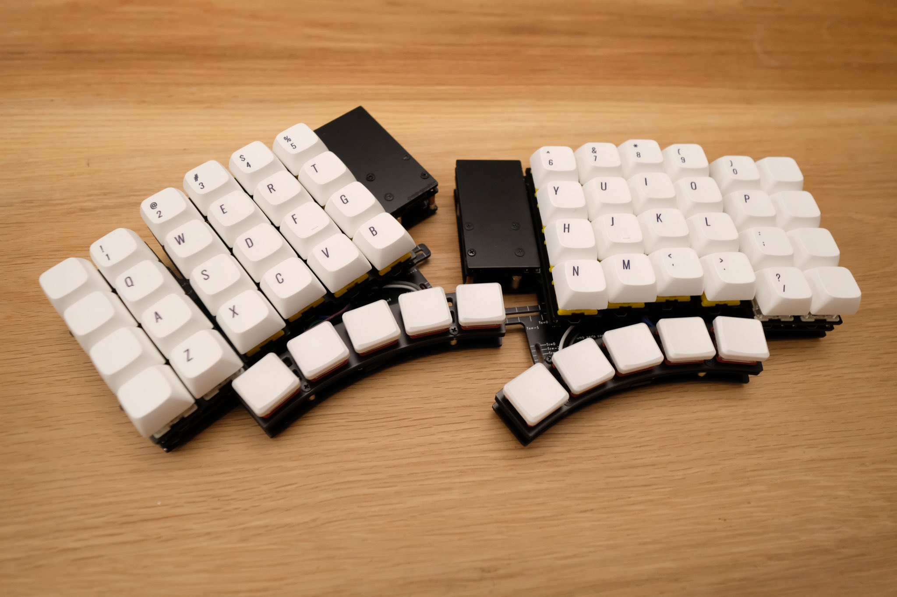

# Pangaea

Parts adjustable keyboard.

## What is Pangaea?

Column staggered keyboards differ in the way the columns are shifted and the thumb keys are placed, depending on the designer's assumed finger size and design philosophy.

Pangaea is a column staggered keyboard that allows you to adjust the key layout for the pinky and thumb areas.

https://user-images.githubusercontent.com/50942793/145424793-fb12e412-2e66-4725-97fb-f4ba11a33d6f.mp4

## Link

[ホワイトペーパー](whitepaper_jp.md), [White Paper](whitepaper_en.md)

[ビルドガイド](build_guide_jp.md), [Build Guide](build_guide_en.md)

[パーツリスト](bom_list_jp.md)

[Firmware](firmware/)

[PCB](design/)

[Gerbers](products/)

## License

* firmware: GPLv3
* Garber files: CC-BY-NC
* other files: MIT