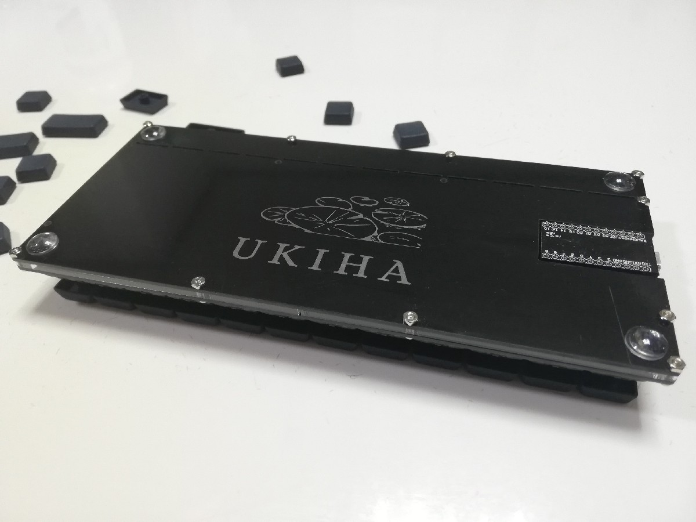
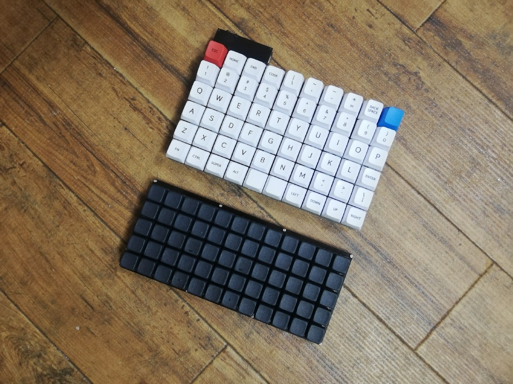

# Pangaea

Parts moveable keyboard.

## What is the Ukiha?

The Ukiha is a 5x12 ortholinear keyboard like the Preonic and JJ50, but with a smaller key pitch of 16mm instead of 19.05mm.

I like expantable keyboard boards like [SU120](https://github.com/e3w2q/su120-keyboard) and [te96](https://github.com/e3w2q/te96-keyboard), but in this case I designed a keyboard that I genuinely wanted.

The *Ukiha* (浮葉) means "floating leaf" and is taken from the Japanese classic, *Pillow Book* (枕草子).

In the book, there is an example of a very small floating lotus leaf taken from a pond as a lovely thing.

うつくしきもの。(中略) 蓮の浮葉のいとちひさきを、池より取りあげたる。(枕草子 第百五十一段より)

## Why open source?

Anyone interested in small key pitch keyboard could try.

## Customizability

The 4 keys in the middle of the bottom row can be replaced with 2U.

You can take off the top row and make it into a 4x12 keyboard like Planck and JJ40.

## Link

[Firmware](https://github.com/e3w2q/qmk_firmware/tree/e3w2q/keyboards/e3w2q/ukiha)

[PCBの入手方法](doc/pcb_order_guide_jp.md)

[パーツリスト](doc/bom_list_jp.md)

[ビルドガイド](doc/readme_jp.md)

