# Pangaea keyboard Build Guide

This is a build guide for the Pangaea Keyboard V1.2.  The original Build Guide written in Japanese is [here](build_guide_jp.md).

The intended audience will be those who have assembled keyboard kits before.  If you have never built a keyboard kit or are not confident about assembling one, please expand the "Tips" section and check it out.  (*note from translater: You will find more detailed information.)

The concept of the Pangaea keyboard is explained in [White Paper](whitepaper_en.md).
The firmware is described in the [Firmware](#Firmware) section, and the source code for QMK Firmware is available [here](firmware/).

The Pangaea Keyboard has a wide variety of optional features that allow you to select the configuration of your choice.  This build guide describes the assembly procedure for a standard configuration. <BR/>*note:  Please refer to [Optional features](#optional-features) for more information on optional features.

- [Pangaea keyboard Build Guide](#pangaea-keyboard-build-guide)
  - [Preparation](#preparation)
    - [Understanding the structure](#understanding-the-structure)
    - [Configuration options](#configuration-options)
    - [Required parts](#required-parts)
  - [Assembly](#assembly)
    - [Assemble the movable Bottom Plate](#assemble-the-movable-bottom-plate)
    - [Assemble the Main Module](#assemble-the-main-module)
    - [Assemble Pinky Module](#assemble-pinky-module)
    - [Assemble Thumb Module](#assemble-thumb-module)
    - [Install Key switches](#install-key-switches)
    - [Combining Modules](#combining-modules)
  - [Firmware](#firmware)
    - [Flash the firmware](#flash-the-firmware)
    - [Operation check](#operation-check)
  - [Final steps](#final-steps)
    - [Rubbter feet](#rubbter-feet)
    - [Keycap](#keycap)
    - [TRRS cable](#trrs-cable)
    - [Completed](#completed)
  - [Adjustment](#adjustment)
    - [Adjust key layout](#adjust-key-layout)
    - [Modifying the key map](#modifying-the-key-map)
  - [Optional features](#optional-features)
    - [Kailh Choc v1 switches](#kailh-choc-v1-switches)
    - [Solder switches on PCB without sockets](#solder-switches-on-pcb-without-sockets)
    - [Height adjustment](#height-adjustment)
    - [Tilts and Tents](#tilts-and-tents)
    - [Preventing PCBs from falling out](#preventing-pcbs-from-falling-out)
    - [Tape LED](#tape-led)
    - [Delete number rows](#delete-number-rows)
    - [Rotary encoder](#rotary-encoder)
    - [Delete rotary encoder part](#delete-rotary-encoder-part)
    - [Delete the extended key](#delete-the-extended-key)
    - [Seprate MPU board](#seprate-mpu-board)
    - [Compatible modules](#compatible-modules)
  - [Further modifications](#further-modifications)
    - [Adding keys](#adding-keys)
    - [Adding rotary encoders](#adding-rotary-encoders)
    - [Adding displays](#adding-displays)

## Preparation

This section describes the preparation before the assembly process.

[Preparation](#preparation) > [Assembly](#assembly) > [Firmware](#firmware) > [Final steps](#final-steps) > [Adjustments](#final-steps) (> [Optional Features](#optional-features) > [Further Modifications](#further-modifications))

* [Understanding the structure](#understanding-the-structure)
* [Configuration options](#configuration-options)
* [Required parts](#required-parts)

### Understanding the structure

First, let's look at the the structure and terminology.
Hereafter, when the engraved side of the keycap is facing up, the upper side is called the front side and the lower side is called the back side.

When the keyboard is assembled, it looks like the picture.

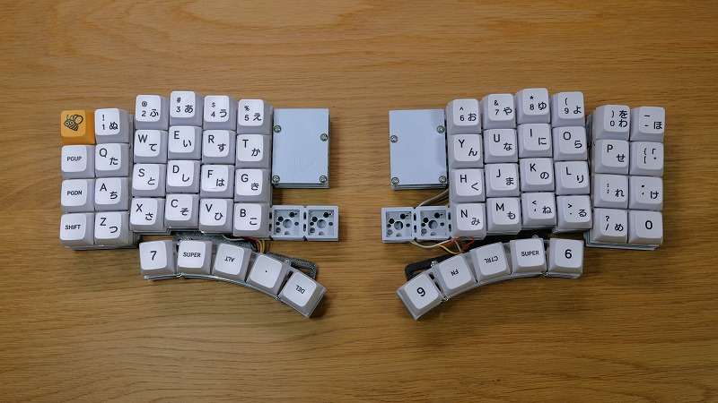

One of the most unique features of the Pangaea Keyboard is the ability to move the positions of the thumb and pinky plates  Not only can you assign what keys to what switches in the software, but you can also adjust the physical key layout.  For example, you can adjust the position of the thumb to shift slightly, or adjust the angle slightly to fit your finger.

The Pangaea Keyboard is divided into three modules of parts for its mechanical adjustment mechanism.

* The largest one in the center is defined as the Main Module.
* The vertical rectangles at the left and right ends are defined as Pinky Modules.
* The lower arc-shaped one is defined as Thumb Module.
* The plate with an open slit between them is defined as Bridge Plate.
* In addition, the modules are connected by cables to transmit electrical signals between modules.

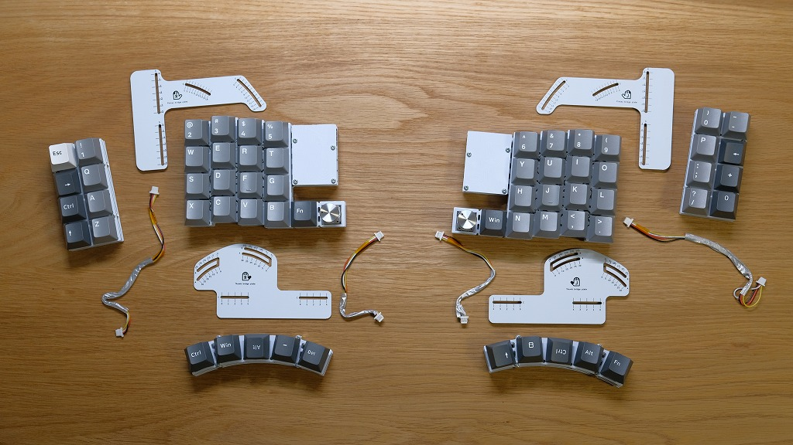

### Configuration options

The Pangaea keyboard has a variety of optional features.  This build guide describes the assembly procedure for a standard configuration.
*note: For more information on optional features, please refer to [Optional features](#optional-features)

The standard configuration described in this build guide is as follows,

* [x] Use Cherry MX compatible switches
* [x] Use switch sockets
* [x] Use through-hole diodes
* [x] Use LEDs (optional)
* [x] Use rotary encoder (optional)
* [x] Solder ProMicro directly to PCB with the pin headers
* [x] Use a vertical (normal) reset switch
* [x] Use the pre-built VIA-compatible firmware
* [x] Use five thumb keys for both hands
* [x] Do not separate the number line, rotary encoder, expansion keys, and ProMicro section
* [x] No other modifications

*note: If you choose an option that differs from the standard configuration, please read the assembly instructions properly before proceeding.

### Required parts

| Category                                              | #    | comment                                                      |
| ----------------------------------------------------- | ---- | ------------------------------------------------------------ |
| --- **PCBs** ---                                      |      |                                                              |
| Main module PCB for left side                         | 1    |                                                              |
| Main module PCB for right side                        | 1    |                                                              |
| Main module cover plate for ProMicro                  | 2    |                                                              |
| Main module switch plate                              | 2    | Common parts for both side                                   |
| Main module bottom plate                              | 2    | Common parts for both side                                   |
| Pinky module PCB                                      | 2    | Common parts for both side                                   |
| Pinky module switch plate                             | 2    | Common parts for both side                                   |
| Pinky module plate                                    | 2    | Common parts for both side                                   |
| Thumb module PCB                                      | 2    | Common parts for both side                                   |
| Thumb module switch plate                             | 2    | Common parts for both side                                   |
| Thumb module bottom plate                             | 2    | Common parts for both side                                   |
| Pinkey bridge palte                                   | 2    | Common parts for both side                                   |
| Thumb bridge plate                                    | 2    | Common parts for both side                                   |
| --- **Electric patrs** ---                            |      |                                                              |
| ProMicro or compatible                                | 2    | ATmega32U4, 5V                                               |
| Pin header                                            | 4    | Included with ProMicro                                       |
| Tact switch for reset                                 | 1*   | *It can also be omitted.<BR/>(It cannot be installed on the right side.)|
| 3.5mm TRRS jack                                       | 2    |                                                              |
| Diodes                                                | 60   |                                                              |
| Switch socket for hotswap                             | 60   |                                                              |
| Cherry MX compatible key switch                       | 60   |                                                              |
| SK682MINI-E (LED)                                     | 12   | optional, it can be omitted.                                 |
| Rotary encoder (potentiometer)                        | 2*   | optional, it can be omitted                                  |
| JST SH 4pin reverse cable 10cm length                 | 2*   | Connection between main and rotary encoder, optinal          |
| JST SH 4pin reverse cable 10cm length                 | 2    | Connection between main and pinky module                     |
| JST SH 4pin reverse cable 15cm length                 | 2    | Connection between main and thumb modules                    |
| JST SH 4pin connector, surface mount side type        | 8    |                                                              |
| --- **Screws** ---                                    |      |                                                              |
| M2 double thread hexagonal spacer, 8mm length         | 24   | Supporting switch plates, 12 for one-hand                    |
| M2 double thread hexagonal spacer, 3mm length         | 4    | PCB support around ProMicro, 2 pieces for one-hand           |
| M2 double thread hexagonal spacer, 6mm length         | 8    | Supporting ProMicro covers, 4 pieces for one-hand            |
| M2 screw, 8mm length                                  | 24   | Fixing the bottom plate, 12 for one-handed                   |
| M2 screw, 3mm length                                  | 48   | Fixing the switch plate, PCB and ProMicro cover, 24 for one-hand |
| --- **Others** ---                                    |      |                                                              |
| USB cable                                             | 1    | Connection between ProMicro and your PC                      |
| TRRS cable                                            | 1    | Connecttion between the left module and right modules        |
| Key caps                                              | 60   | All 1u size                                                  |
| Knob for rotary encoder                               | 2    | Up to 19mm in diameter                                       |
| Tapes                                                 | -    | To hold cables together, optional                            |
| Insulating tape                                       | -    | To secure the cable to the PCB for easier routing, optional  |
| Rubber foot, 2.2mm thick                              | 10   | Attach to bridge plate                                       |
| Rubber foot, 3.8mm thick                              | 20   | Attach to bottom plate                                       |

Please refer to [Parts List (BOM)](bom_list_jp.md) for detailed model numbers and availability of each part.  Please use JST SH cables with the same pin assignments on both ends, reverse cable.

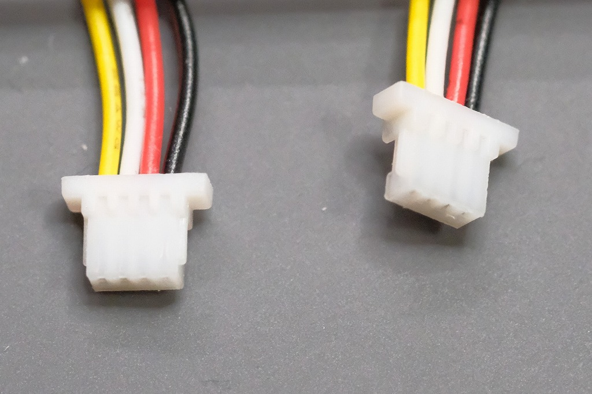

The type and number of components required may vary depending on the option selected.
*note: Please refer to [Optional features](#optional-features) for more information about optional features.

Here is a photo of all the circuit boards lined up. Make sure there are no shortages.

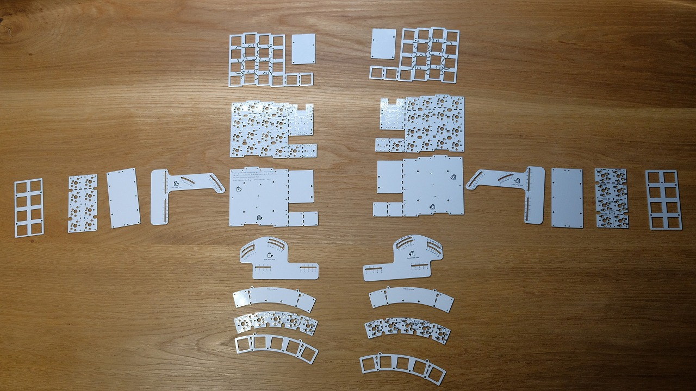

* Main Module PCB has different parts on the left and right sides.
* Pinky and Thumb Modules are the same on the right and left hand sides.
* Main Module switch plate, Main Module bottom plate, and Bridge Plate are the same on the left and right sides, but the orientation used is different.
  * Use them in the orientation where the left hand side is the one with the "L" mark when viewed from the **reverse side** and the right hand side is the one with the "R" mark when viewed from the **reverse side**.

## Assembly

[Preparation](#preparation) > [Assembly](#assembly) > [Firmware](#firmware) > [Final steps](#final-steps) > [Adjustments](#final-steps) (> [Optional Features](#optional-features) > [Further Modifications](#further-modifications))

* [Assemble the movable Bottom Plate](#assemble-the-movable-bottom-plate)
* [Assemble the Main Module](#assemble-the-main-module)
* [Assemble Pinky Module](#assemble-pinky-module)
* [Assemble Thumb Module](#assemble-thumb-module)
* [Install Key switches](#install-key-switches)
* [Combining Modules](#combining-modules) 
* 
Even if you make a mistake in the order of assembly, it will not be irreversible. Please proceed with the assembly with ease.

### Assemble the movable Bottom Plate

First, assemble the movable Bottom Plate, which is the best part of the Pangaea Keyboard, the variable mechanism.

Then, attach 8mm screws and 8mm spacers at the positions circled in red. From the back side, stack the screw heads, Bridge Plate, Bottom Plate, and spacers in this order.

The finished keyboard will look like the picture below. It contains a mechanism that allows the pinky and thumb modules to be freely adjusted in relation to Main Module.

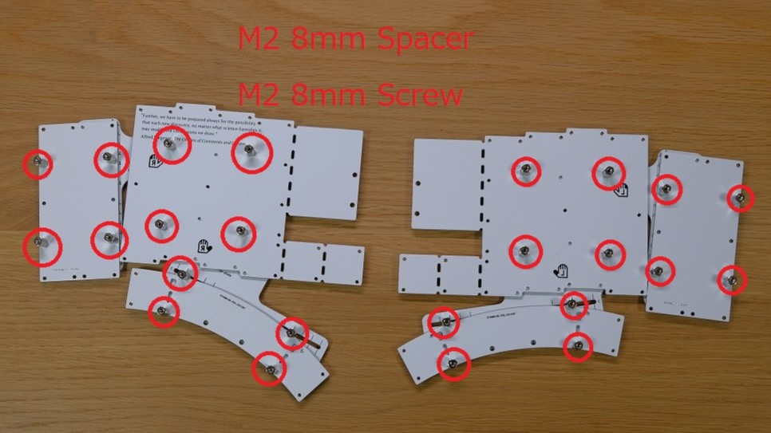

The picture below shows it from the back.

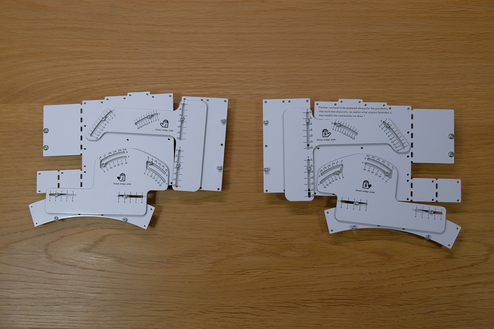

<details>
<summary>Tips: Using washers</summary>
<div>
For smoother operation after assembly, we recommend using washers and spring washers for moving parts. If you screw directly, the screws will loosen easily, and it will be inconvenient to use a screwdriver to screw in the screws for adjustment. By using washers and spring washers, the parts can be moved even when the screws are tightened to some extent, which makes adjustment after assembly easier.
</div>
</details>

*note: The lengths of screws and spacers used for assembly are shown in the figure below.

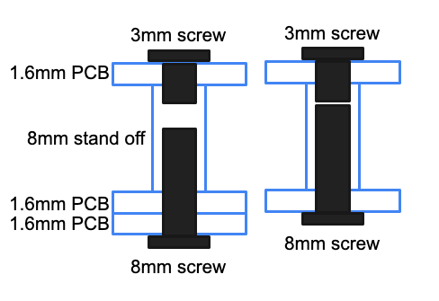

### Assemble the Main Module

Components are installed on the PCB of each module, starting with Main Module.

[Preparation](#preparation) > [Assembly](#assembly) > [Firmware](#firmware) > [Final steps](#final-steps) > [Adjustments](#final-steps) (> [Optional Features](#optional-features) > [Further Modifications](#further-modifications))

The following components are installed in the Main module.

* [LED (optional)]
* [SH connector]
* [Diode]
* [Switch socket]
* [ProMicro]
* [TRRS jack]
* [Reset switch (optional)]

#### LED (Optional)

Solder the LEDs to the **reverse** side of the PCB, with the **glowing side** of the LED facing outward.  The microcontroller-embedded LEDs are sensitive to high temperatures, so lower the soldering iron temperature. 250°C or lower is recommended.

The LEDs are oriented for installation.  Align the diagonally cut leg of the LED terminal with the triangular mark on the PCB (red line).

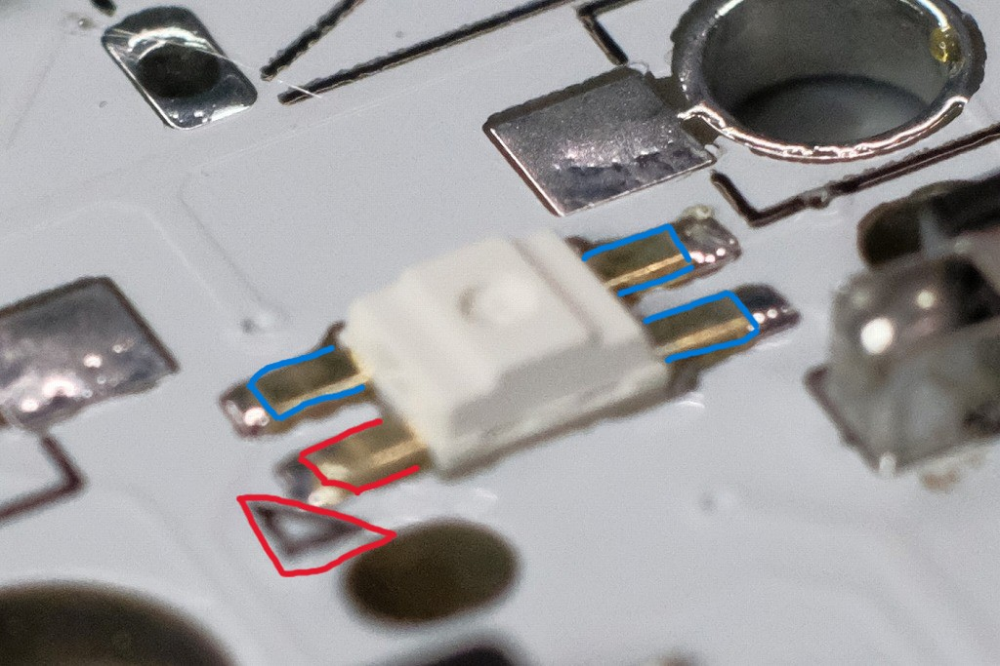 

#### SH connector - receptacle

Solder the receptacle of the SH connector to the **back** side of the PCB. This is somewhat difficult, so do it carefully. Attach the connectors for the pinky module and the thumb module, respectively.

If you use a rotary encoder is used, also solder the SH connector for the rotary encoder.

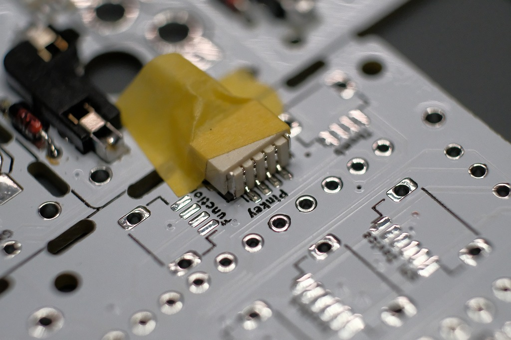 

Pour solder into the through-holes from the back side and solder the fixing feet on both ends of the SH connector.
(Translator's note: If you forget to do this, the connector may come off due to lack of strength when inserting or removing the cables.)

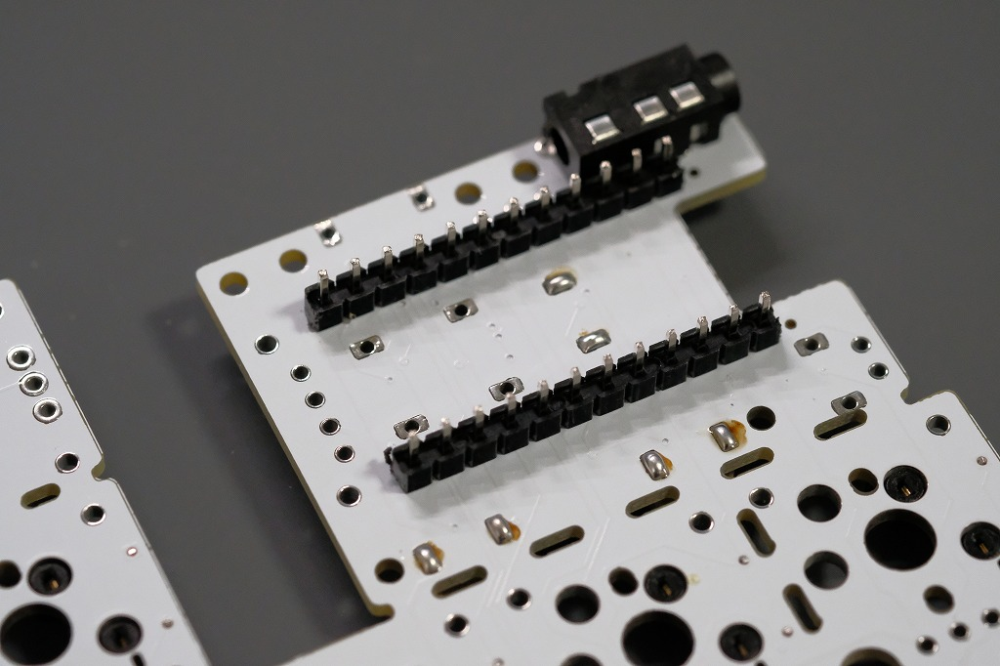

#### Diode

Solder the diode to the **back** side of the PCB.

Orient the diode so that the white line on the PCB (or the black line if the PCB is white) aligns with the black line on the diode.

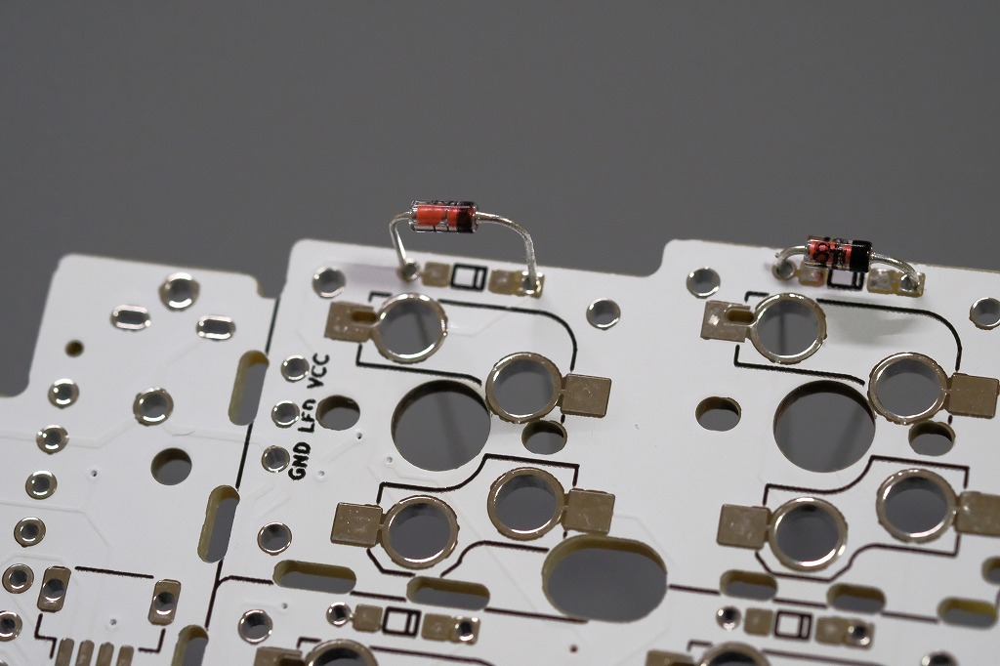 

When using Surface Mount Device (SMD) diodes, align the wires of the SMD diode with the wires on the PCB. In the example in the photo, the left wire marked T4 is aligned with the wire on the PCB.

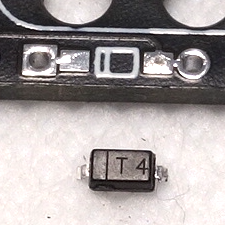

This is a view of Main Module PCB for the left hand side from the back. We will now assemble the left one first.

#### Switch socket

The switch socket is similarly soldered to the **back** side of the PCB.  If Cherry MX compatible switch is used, install the socket on the top side.


#### Reset switch

Solder from the **Surface** side of the PCB.
*note: The reset switch cannot be installed on the right hand side. (When resetting, short the through-hole with tweezers, etc. instead of pressing the reset switch.)

#### 3.5mm TRRS jack

Solder from the **Surface** side of the PCB.

#### Pro Micro

Mount the ProMicro on the **front** side of Main Plate PCB with the ProMicro facing down, i.e., the smooth side of the ProMicro is facing up and the side with the various components on it is hidden.

*note: If you want to use the spring pin header, please search for "ProMicro spring pin header". In case of Japan, Yousha Kobo's materials are easy to understand.[コンスルー（スプリングピンヘッダ）の取り付け方を教えて下さい – 遊舎工房サポートサイト (zendesk.com)](https://yushakobo.zendesk.com/hc/ja/articles/360044233974-コンスルー-スプリングピンヘッダ-の取り付け方を教えて下さい)
*note from translator(I'm afraid this is written in Japanese only.)

First, insert the ProMicro supplied pin headers into the PCB. Insert the long one with the short side up.


The back side pops out like this.

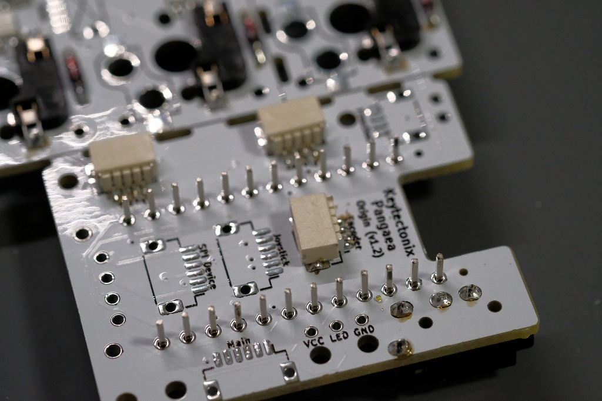

Next, ProMicro is layered on top.

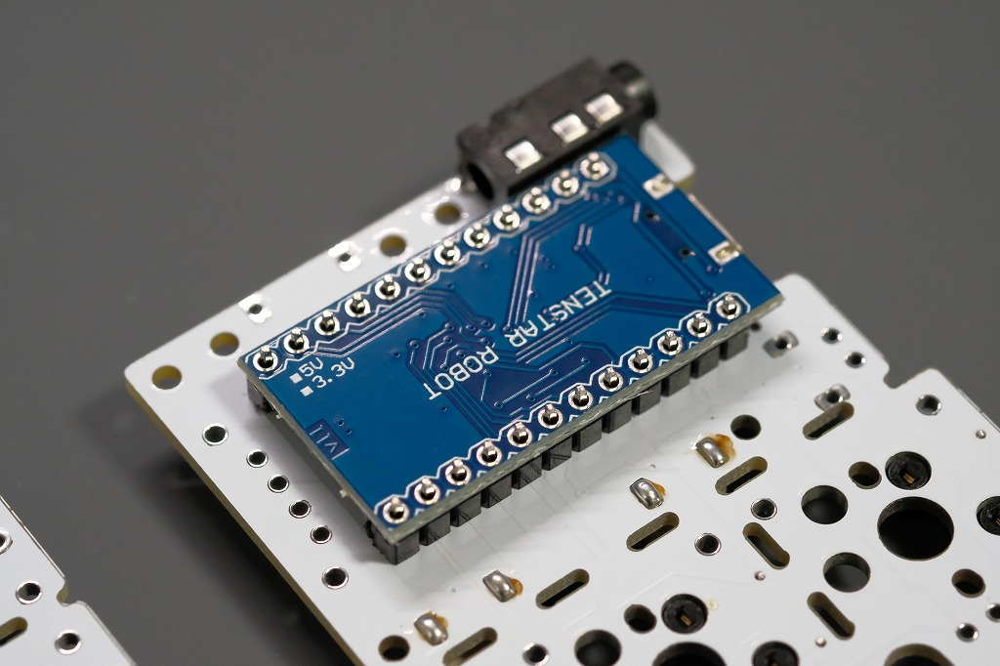

Solder the ProMicro and pin headers. Be careful not to bridge the solder with adjacent pins.

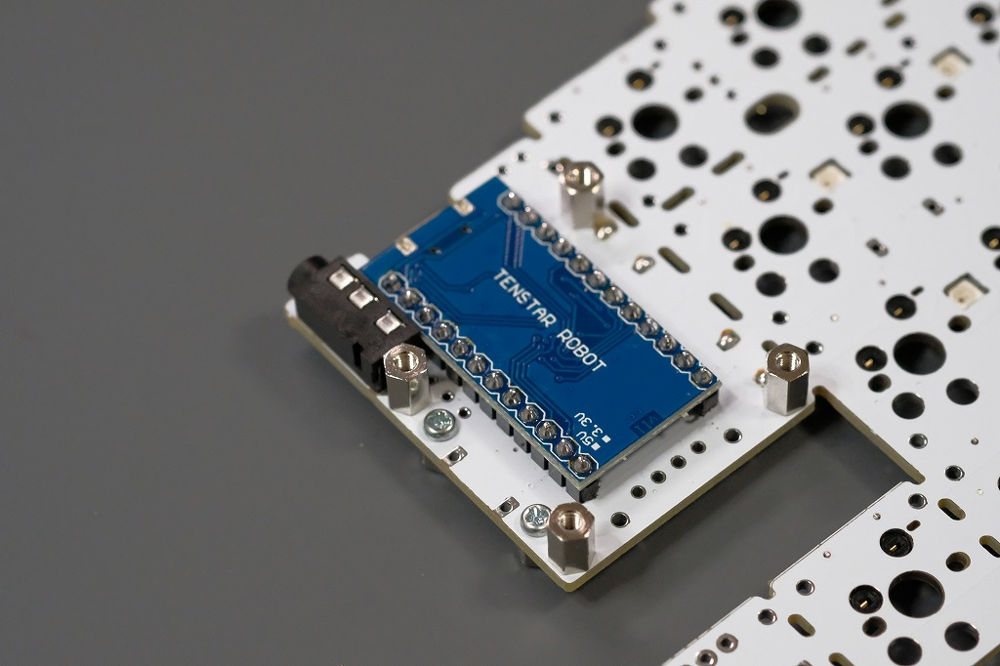

Then, use nippers to cut the pin headers that stick out on the back side into short pieces, and solder the pin headers to the Pangaea Main Plate PCB.

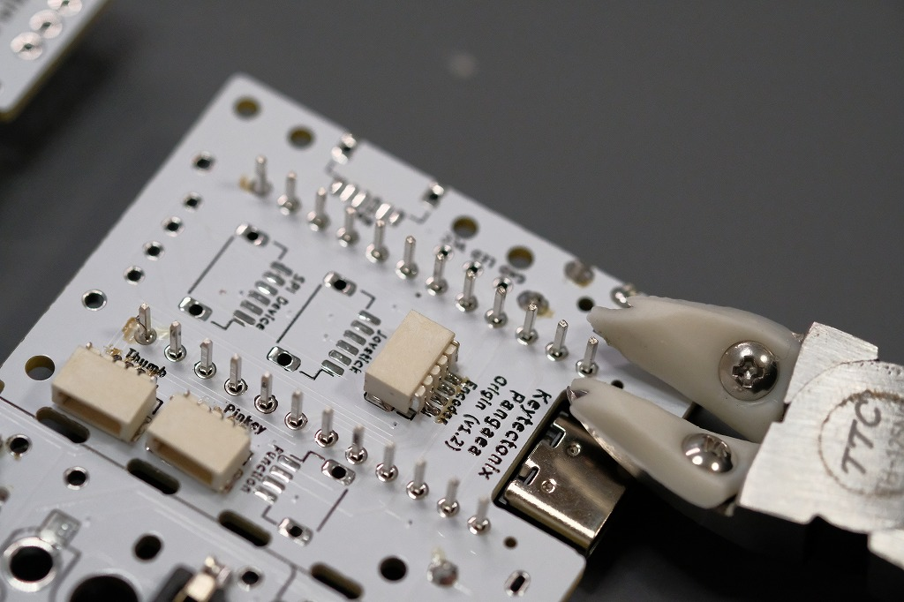

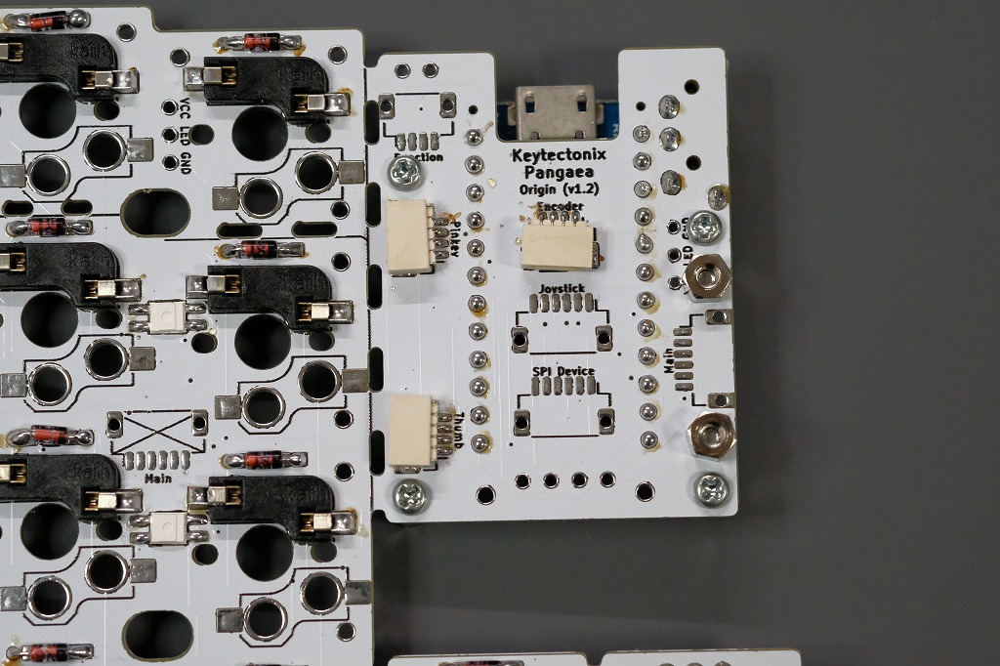

*note: When cutting pin headers, be very careful not to let the cut ends fly off.

#### Screw down the standoffs that support the ProMicro

Install M2 3mm screws and M2 3mm spacers at the positions indicated by the light blue circles. This spacer is used to support around the ProMicro on the PCB.  It can be combined with the bottom plate in a later process.

 

The figure below shows it from the back.


#### ProMicro cover

Install M2 3mm screws and M2 6mm spacers on the **front** side of Main Module PCB; insert M2 3mm screws from the backside of the Main Module PCB to secure.
Place the cover plate over the Pro Micro and secure with M2 3mm screws in 4 places.  The plate has two sides, so be sure to align the spacers and cover with each other.

#### Rotary Encoder (option)

Solder the rotary encoder.  If you use a toray encoder with a push switch, solder the terminals of the switch as well.

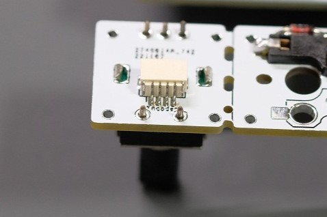 

This completes the soldering of Main Module PCB.


### Assemble Pinky Module

Next, let's assemble Pinky Module.

[Preparation](#preparation) > [Assembly](#assembly) > [Firmware](#firmware) > [Final steps](#final-steps) > [Adjustments](#final-steps) (> [Optional Features](#optional-features) > [Further Modifications](#further-modifications))

Solder the following components as for Main Module,

* SH connector, receptacle
* Diode
* Switch socket

Make sure that eight diodes are soldered for the number of keys. If you count the number of diodes, you will not miss anything.

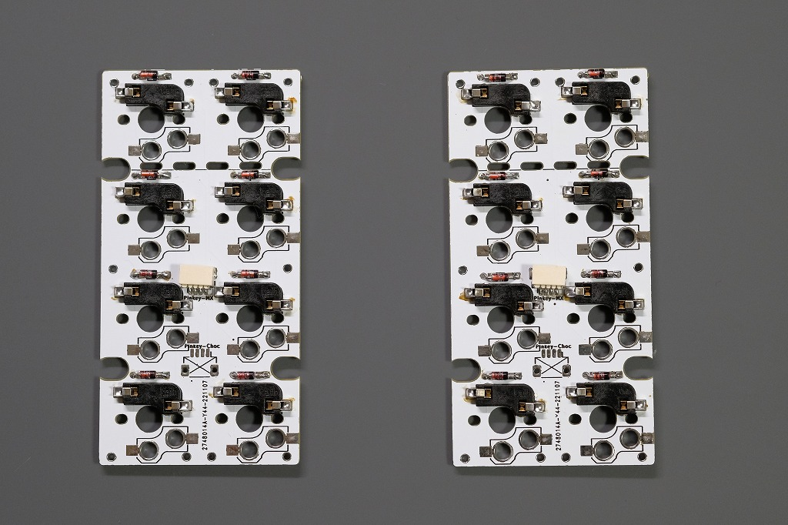

When using Cherry MX compatible switches, solder SH connectors where it says "Pinkey-MX" on the PCB.
*note: When using choc switches, solder the SH connector where it says "Pinkey-Choc" on the PCB.

### Assemble Thumb Module

Finally, let's assemble Thumb Module.

[Preparation](#preparation) > [Assembly](#assembly) > [Firmware](#firmware) > [Final steps](#final-steps) > [Adjustments](#final-steps) (> [Optional Features](#optional-features) > [Further Modifications](#further-modifications))

Solder the following components in the same manner as for Main Module and Pinky Module.

* SH connector
* Diodes
* Switch sockets

Choose one of two positions to solder the SH connector. Operation is the same regardless of which way it is soldered.
Imagine the range of motion and select the one that is easier to handle the cable.  It is recommended that the left hand side be attached at the position closer to the left when viewed from the front, and the right hand side be attached at the position closer to the right when viewed from the front.

After soldering is finished, the following picture should look like this. Check again that the diodes are oriented correctly.

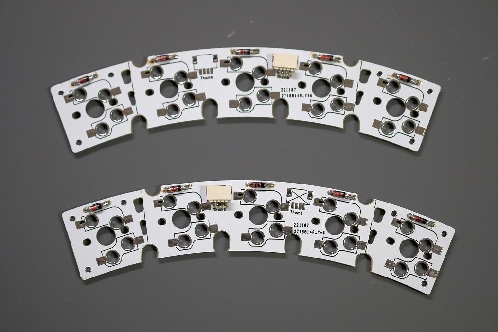  

Now we have three PCB for Main, Pinky and Thumb.

### Install Key switches

[Preparation](#preparation) > [Assembly](#assembly) > [Firmware](#firmware) > [Final steps](#final-steps) > [Adjustments](#final-steps) (> [Optional Features](#optional-features) > [Further Modifications](#further-modifications))

Insert the key switches into the top plate of each module and secure it by inserting the legs of the keyswitch into the sockets on the PCB.
Be careful not to bend the legs of the key switch when inserting it into the socket.

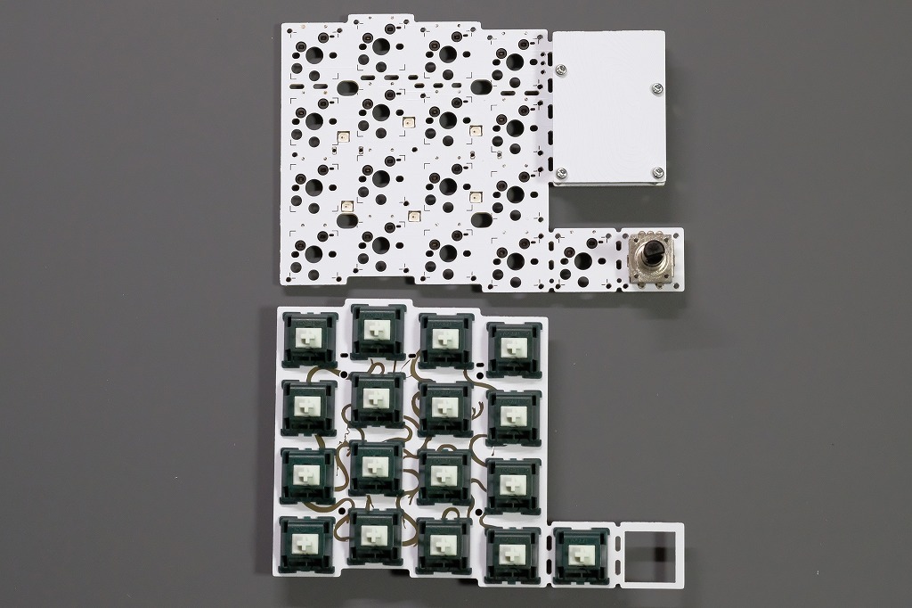  
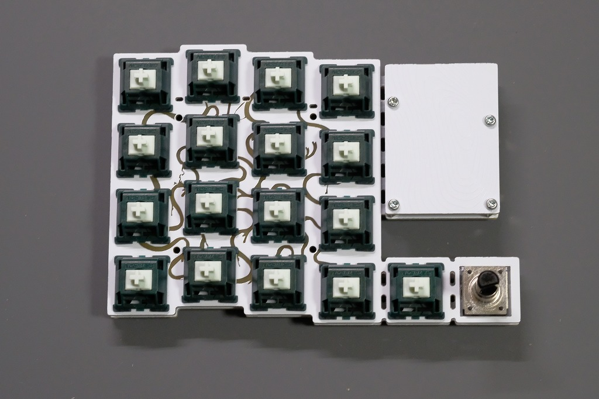  

Observe from the backside to verify that all switch legs are in the sockets without bending.

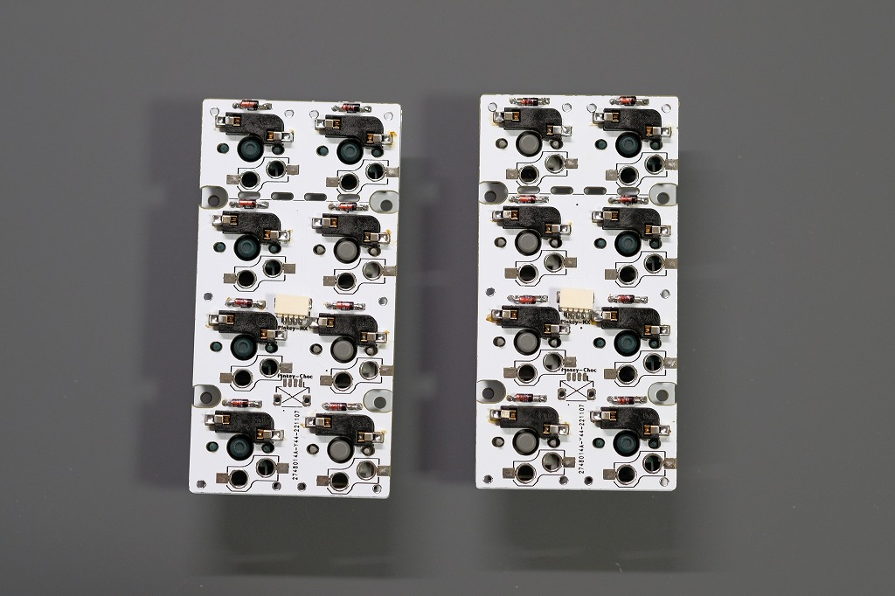  

### Combining Modules

[Preparation](#preparation) > [Assembly](#assembly) > [Firmware](#firmware) > [Final steps](#final-steps) > [Adjustments](#final-steps) (> [Optional Features](#optional-features) > [Further Modifications](#further-modifications))

The three modules will be combined.

#### Signal connection between modules

Connect signals between plates using a cable with SH connectors.

Connect the cable to the Main Module.  If a rotary encoder is installed, also connect the cable between the rotary encoder and Main Module PCB.
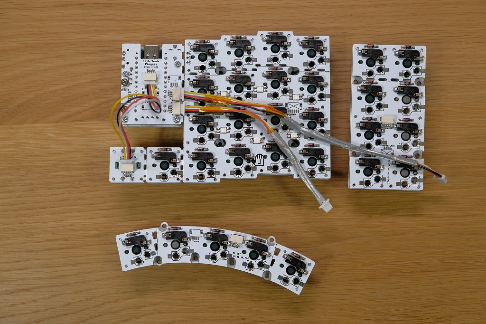

Fix the cable to the PCB with insulating tape, etc.
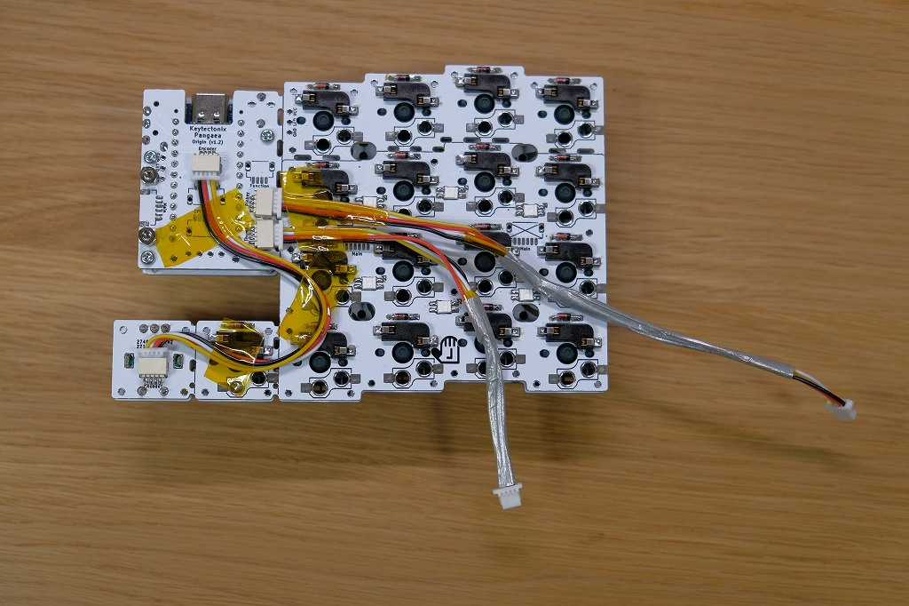

Connect the other end of the cable to Pinky and Thumb Modules.
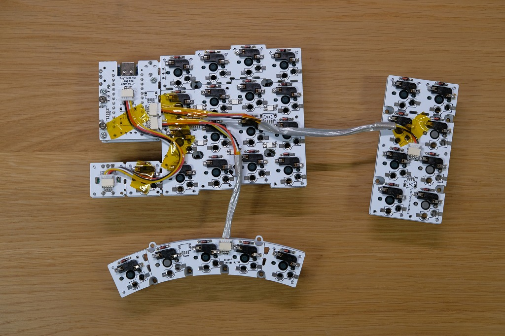

If the wire is too short, it may be pulled during adjustment, resulting in a restricted range of motion, or the wire may break. It is recommended that the wire be at least 10 cm long. If the wire is too long, it will interfere with the bottom plate.

<details>
<summary>Tips: Organize cables</summary>
<div>
If the cable does not fit well between the PCB and the bottom plate, use tape to secure the cable to the PCB before assembling the bottom plate.
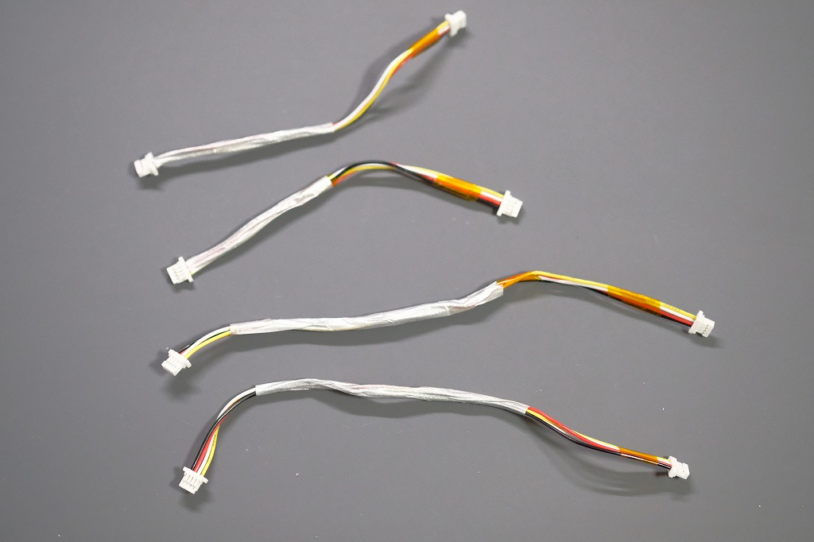
</div>
</details>

#### Coupling with Bottom Plate

Finally, the PCB and Bottom Plate are integrated. Place Main Module with switches, Thumb Module, and Pinkey Module on top of the Bottom Plate and secure them with M2 3mm screws from the top plate.

First, attach Main Module to Bottom Plate.
To make it easier to pass Bottom Plate spacers through the PCB holes, loosen the bottom plate screws slightly before overlapping them. <br/>
When they overlap without any gaps and not at an angle, insert the screws from the surface of the switch plate and tighten them. <br/>
After tightening the screws, retighten the screws on the side of the bottom plate that you loosened earlier. <br/>
There are four fixing points.

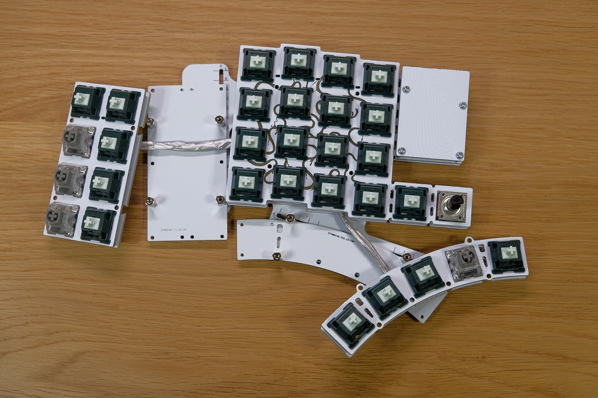

There are four fixed locations for each.

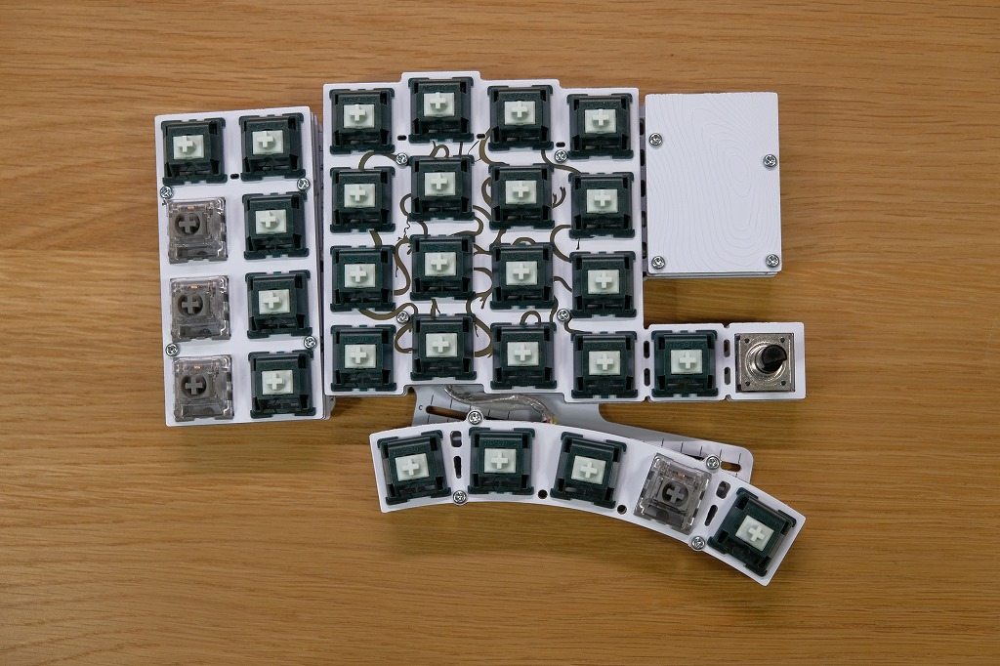

Here is a photo of the back side.

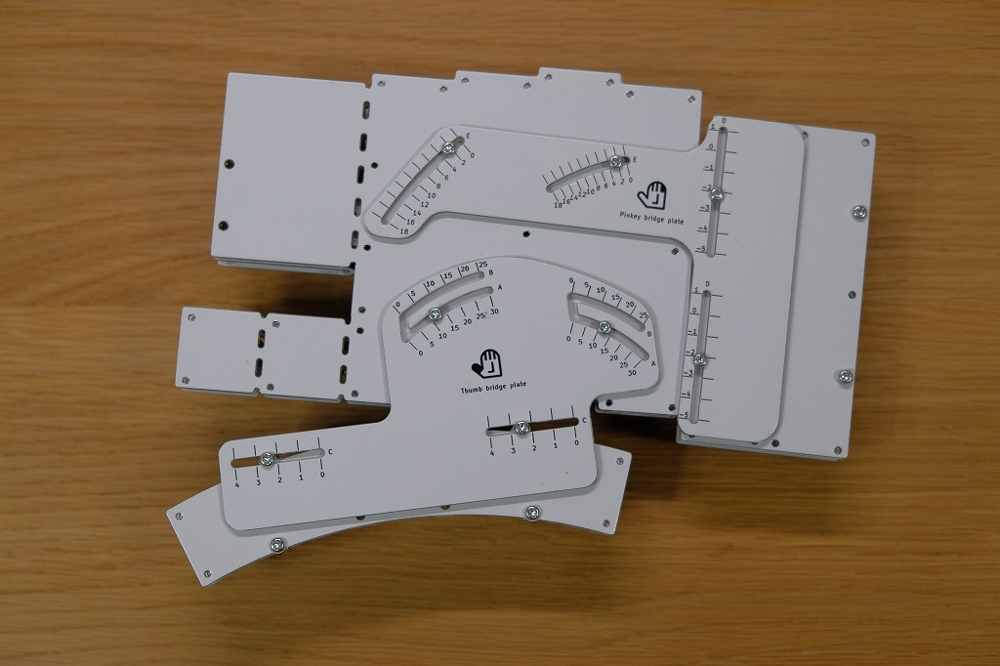

Also secure the bottom plate and the feet supporting the ProMicro with M2 3mm screws. Fix two places from the bottom of the bottom plate with M2 3mm screws.

Assemble the right hand side in the same manner.

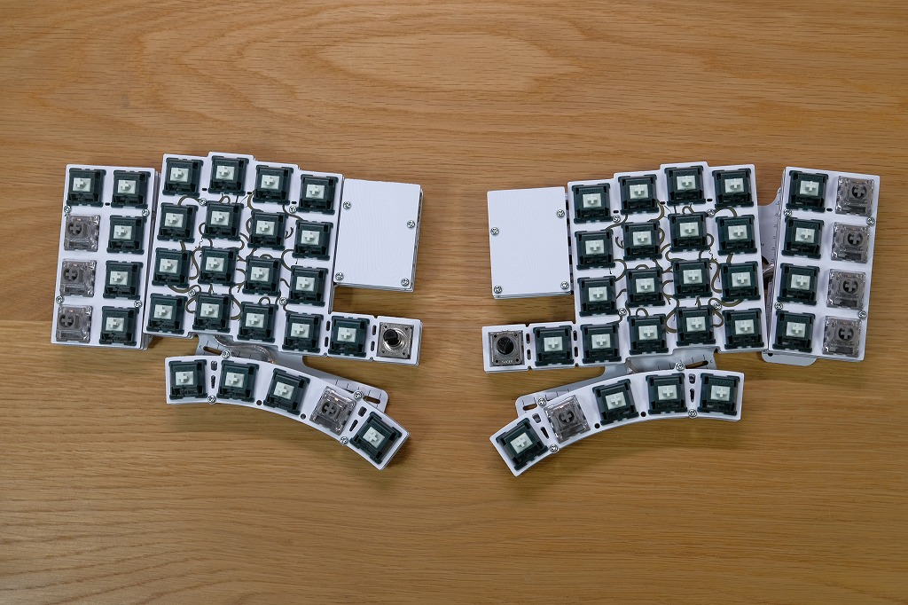

## Firmware

Write firmware into ProMicro and check operation.

[Preparation](#preparation) > [Assembly](#assembly) > [Firmware](#firmware) > [Final steps](#final-steps) > [Adjustments](#final-steps) (> [Optional Features](#optional-features) > [Further Modifications](#further-modifications))

  - [Firmware](#firmware)
    - [Flash the firmware](#flash-the-firmware)
    - [Operation check](#operation-check)

In this state, write the firmware and check the operation. If you are confident, you may skip this step and conduct it after completion.

### Flash the firmware

Flash the firmware in one of the following ways.  Download the hex from remap stie.

#### Flash the firmware using QMK Toolbox

QMK Toolbox is used here.

Open the hex file in QMK Toolbox. Connect the keyboard.

Press the reset switch to reboot the keyboard in bootloader mode.
<br/>

Since a reset switch cannot be installed on the right hand side, short the through-hole with tweezers, etc. instead of pressing the reset switch.  If it is successful and you enter bootloader mode, you will see the message "~device connected" in QMK Toolbox.

If pressing the reset switch does not put you in bootloader mode, try pressing the reset switch twice quickly.
(*note from translater: Since there is a Pro Micro that requires such operation)

Click the "Flush" button on the QML Toolbox. <br/>
Wait without unplugging the USB cable. <br/>
When the QMK Toolbox screen indicates success, the write is successful; you can unplug the USB cable.

Then write the firmware to the other Pro Micro in the same way.  There is no difference between the left and right firmware.

#### Flash the firmwarey using QMK command line tool

Go to the QMK directory, and then type

```sh
$ cd qmk_firmware
```

Flashes firmware to the ProMicro, along with compile.

```sh
$ qmk flash -kb pangaea -km default
```

### Operation check

After writing the firmware is completed, unplug the USB cable and then connect the left and right sides with the TRRS cable, and connect the USB cable only to the left side. <br/>
Do not unplug and plug the TRRS cable while the PC and keyboard are connected with the USB cable; this may short the terminals of the TRRS jack and cause the keyboard to malfunction.

Check the operation of each key on the PC.
If there is a problem such as some switches cannot be input, check the soldering carefully. If only some keys cannot be input, the possible causes include

* The diode is not installed or not soldered properly
* The diode is installed in the wrong direction
* The switch socket is installed backwards and the switch is not stuck in the first place
* The switch socket is not soldered properly, resulting in poor contact
* The leg of the switch is broken and not properly inserted into the switch socket

How could such a mistake be made? You may think so, but take a closer look.
After checking the operation, remove the USB cable and TRRS cable before returning to the rest of the assembly work.

## Final steps

Final finishing touches,

[Preparation](#preparation) > [Assembly](#assembly) > [Firmware](#firmware) > [Final steps](#final-steps) > [Adjustments](#final-steps) (> [Optional Features](#optional-features) > [Further Modifications](#further-modifications))

 * [Rubbter feet](#rubbter-feet)
 * [Keycap](#keycap)
 * [TRRS cable](#trrs-cable)

### Rubbter feet

Attach the rubber feet to the back of the bottom plate. The thickness of 3.8mm is the best size for the rubber feet without adding extra thickness to the entire keyboard.  There is no rule for the position of the rubber feet, but it is best to stick them on the four corners of the plate as shown in the photo to keep a good balance.

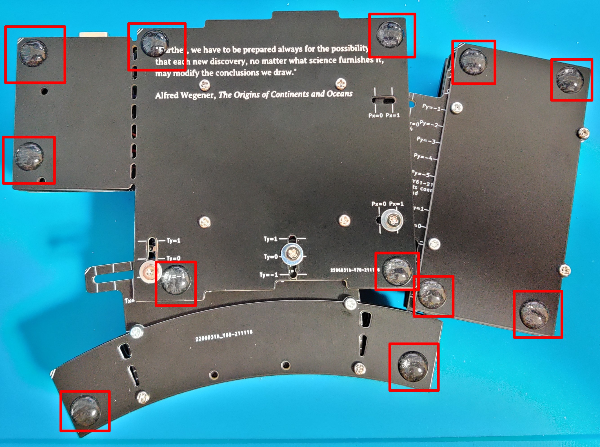

While checking the range of motion, affix it in a position that does not interfere with the motion.
The following is an example for version 1.2.

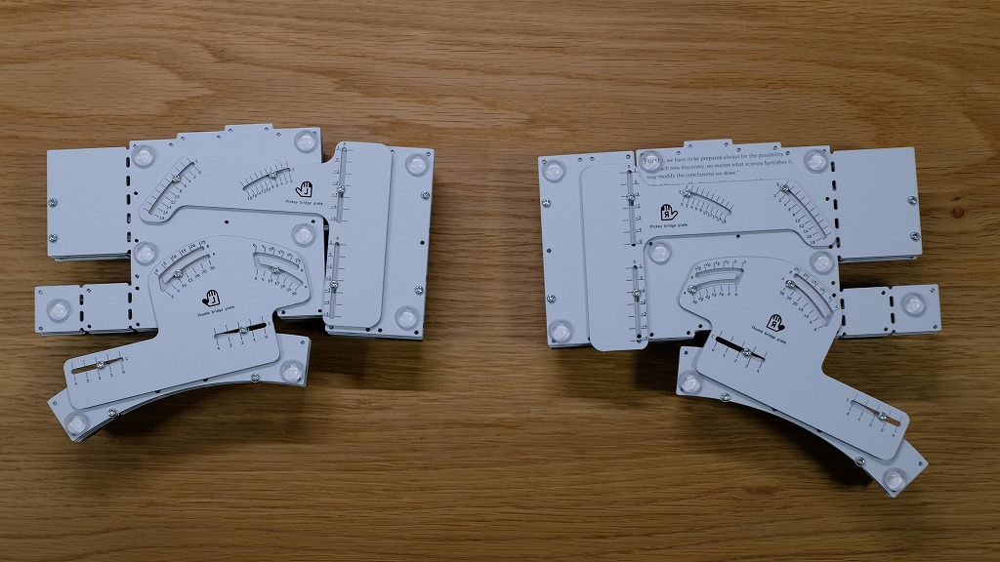  

For additional stability, add 2.2mm-thick rubber feet to the bridge plate.  The total height of the 1.6mm-thick bridge plate and the 2.2mm-thick rubber feet is exactly the same as the 3.8mm-thick rubber feet on the bottom plate.

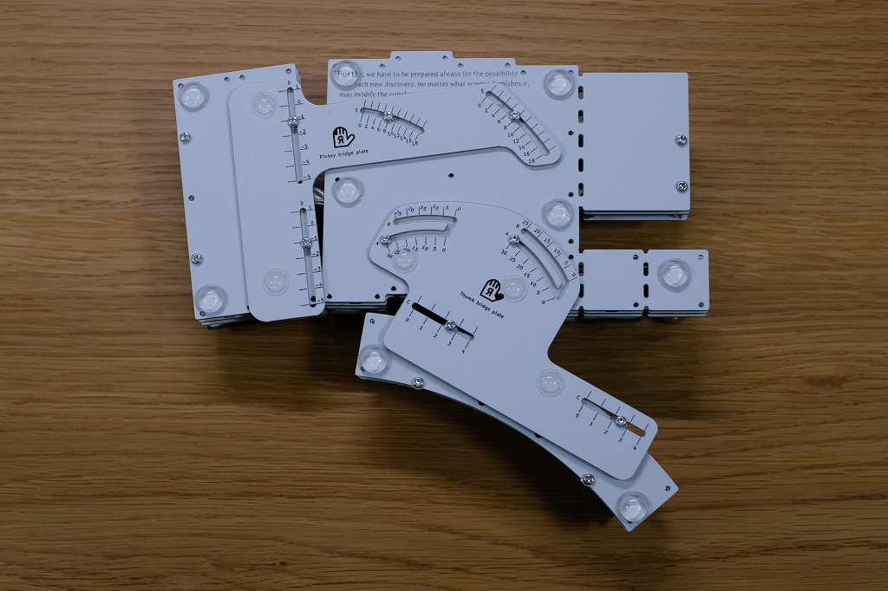  

### Keycap

Install the key caps. If a rotary encoder is installed, install the knob as well.

### TRRS cable

Connect the left and right keyboards with the TRRS cable.

Be sure to connect the TRRS cable before connecting the keyboard and PC with the USB cable.
Also, be sure to disconnect the TRRS cable after disconnecting the keyboard from the PC.
Disconnecting and unplugging the TRRS while the keyboard and PC are connected with the USB cable may cause the TRRS terminals to short-circuit, resulting in a malfunction.

### Completed

It is completed. Good job!
Here is a shot of the Polycaps Seals when they were installed.

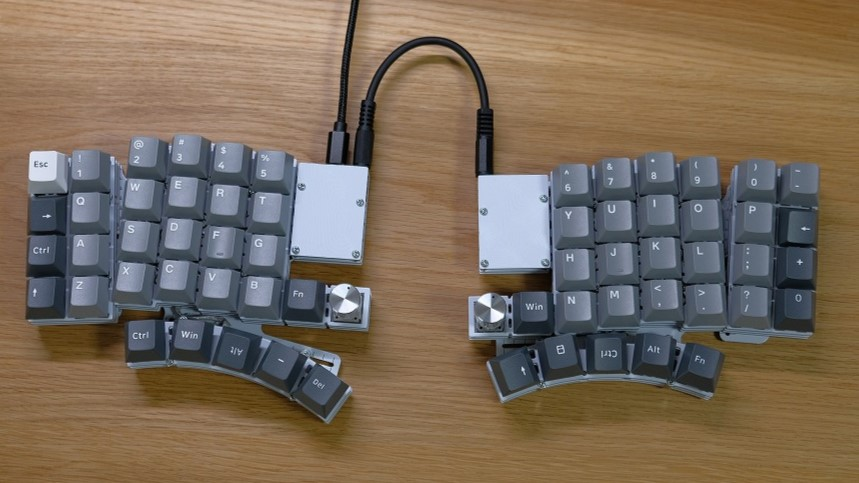

## Adjustment

Adjust the physical key layout and the software keymap.

[Preparation](#preparation) > [Assembly](#assembly) > [Firmware](#firmware) > [Final steps](#final-steps) > [Adjustments](#final-steps) (> [Optional Features](#optional-features) > [Further Modifications](#further-modifications))

* [Adjust key layout](#adjust-key-layout)
* [Changing the key map](#changing-the-key-map)

### Adjust key layout

One of the values of the Pangaea keyboard is the ability to adjust key positions.

You can find the latest firmware from [here](https://github.com/e3w2q/Pangaea-keyboard)

#### Adjustment Main Module

A length scale is provided for adjustment between the left and right main plates in the x-axis and y-axis directions.

#### Adjustment Thumb Module

The thumb module is adjustable in lateral position and rotation angle.  The adjustable range is ±0.0U to +1U for lateral position and 0° to 30° for rotation in the direction that the thumb tip side turns downward.

#### Adjustment Pinkey Module

The pinky plate can be adjusted for vertical position and rotation angle.  The adjustable range is +0.25U to -1.25U for vertical position and 0° to 18° for rotation in the direction that the upper side turns outward.

### Modifying the key map

The firmware written by the above procedure supports keymap changes by VIA and [Remap (remap-keys.app)](https://remap-keys.app/).

Please set the keymap according to the instructions of each software.
Pangaea's page in Remap's keyboard catalog is here. [Pangaea - Remap](https://remap-keys.app/catalog/t9RGwMnHCRjLxs937jxh)

## Optional features

This section describes the optional features of the standard kit.

[Preparation](#preparation) > [Assembly](#assembly) > [Firmware](#firmware) > [Final steps](#final-steps) > [Adjustments](#final-steps) (> [Optional Features](#optional-features) > [Further Modifications](#further-modifications))

* [Kailh Choc v1 switches](#kailh-choc-v1-switches)
* [Solder switches on PCB without sockets](#solder-switches-on-pcb-without-sockets)
* [Height](#height)
* [Tilts and Tents](#tilts-and-tents)
* [Tape LED](#tape-led)
* [Delete number rows](#delete-number-rows)
* [Rotary encoder](#rotary-encoder)
* [Delete rotary encoder part](#delete-rotary-encoder-part)
* [Delete the extended key](#delete-the-extended-key)
* [Seprate MPU board](#seprate-mpu-board)
* [Compatible modules](#compatible-modules)
  
### Kailh Choc v1 switches

Additional parts required: Socket for Kailh Choc v1 switch, Kailh Choc v1 switch

Compared to using Cherr MX compatible switches, the following points will change,

* Type of socket and mounting orientation
* Spacers and screw lengths to be used

### Solder switches on PCB without sockets

By pouring a large amount of solder between the keyswitch foot and the hole in the PCB, the keyswitch can be attached without using a switch socket.  Be careful not to forget to attach the switch plate.

### Height adjustment

By changing the length of the spacers, the height can be adjusted for each module.
For example, by changing the spacers, standoffs of Main Module and the Pinkey Module to longer ones, only Thumb Module can be made relatively lower.

Also, in the z-axis direction, the length of the standoffs can be made a little lower than the main plate. You can also reduce the height relative to Main plate by making only the Thumb Module using Choc switches.

### Tilts and Tents

As an application of height adjustment, the tilt and tent angle of each module can be adjusted by combining spacers of different lengths.

For example, Main plate can be height adjusted in the z-axis direction. The two standoffs in the center direction can be raised and tilted toward the center.  Be careful not to tighten the screws too hard, as this will put a load on the PCB and the plate.

### Preventing PCBs from falling out

The PCB and bottom plate have M1.4 screw holes. The PCB can be supported by inserting screws into those holes and using nuts.  Refer to the following pictures for more information.

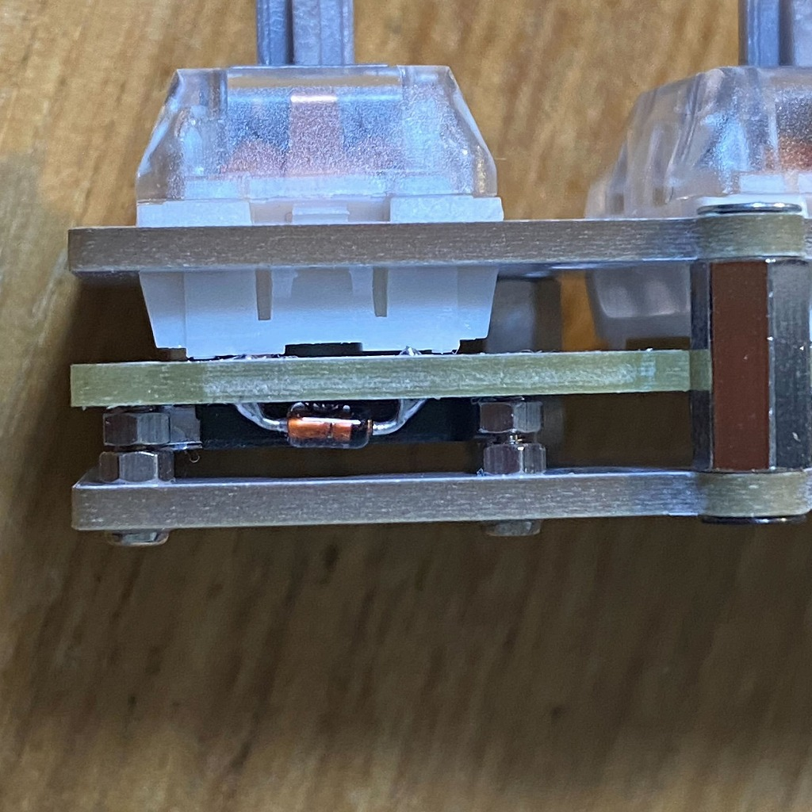 
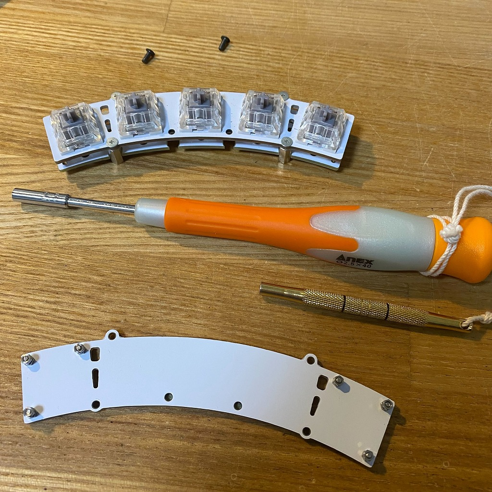 
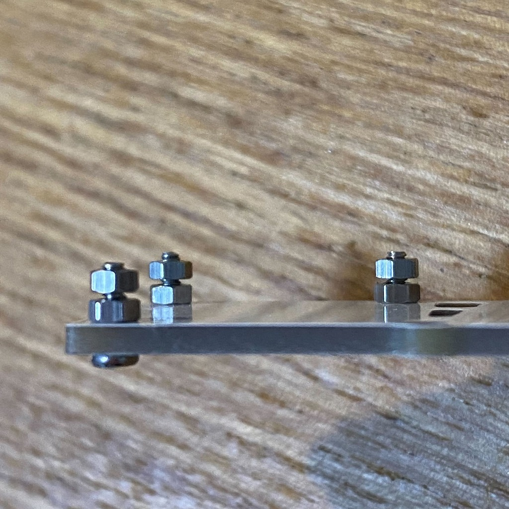

### Tape LED

Additional required components : Tape LEDs

Tape LEDs can be added; you can add tape LEDs instead of NeoPixcel or implement both NeoPixel and tape LEDs.  The standard firmware allows for six LEDs. When using tape LEDs, please cut the tape LEDs so that there are six  LEDs.

### Delete number rows

The number of keys on Main and Pineky Modules can be changed from 4 to 3 rows.
To reduce the number of rows, disconnect the switch plate and PCB.

It is not possible to undo this change, so please use your best judgment and cut carefully.

### Rotary encoder

Enable the rotary encoder: connect the back of Main Module to the rotary encoder with the SH connector cable.

### Delete rotary encoder part

The rotary encoders on the main module can be deleted.  To remove the rotary encoder, disconnect the switch plate, PCB, and bottom plate.

It is not possible to undo this change, so please use your best judgment and cut carefully.

### Delete the extended key

The extension key next to the rotary encoder on Main Module can be deleted.  To delete the extension key, disconnect the switch plate, PCB, and bottom plate.

When you delete the extension key, the rotary encoder is deleted at the same time.
If the rotary encoder is used and the expansion key is not used, do not remove the expansion key and remove the key switch only, for example.

It is not possible to undo this change, so please use your best judgment and cut carefully.

### Seprate MPU board

The Pro Micro portion of Main Module can be detached. If you want to add keys on the inside or place a trackball, for example, and this part gets in the way, you can detach it and move it to another location by wiring it to the main plate.

1. detatch the PCB
2. wiring the main plate to the Micro Pro board

### Compatible modules

Each module can be replaced with one designed to the same standard as the Pangaea keyboard, or additional modules can be added.  In the future, there will be a part with the outermost keys of the module lowered downward.  You can also design your own compatible modules.

For more information on designing compatible modules, please refer to the "Designer's Guide (currently being written)". If you have any questions, please contact the Pangaea development team.

## Further modifications

This section describes modifications using boards outside the standard kit.

[Preparation](#preparation) > [Assembly](#assembly) > [Firmware](#firmware) > [Final steps](#final-steps) > [Adjustments](#final-steps) (> [Optional Features](#optional-features) > [Further Modifications](#further-modifications))

The standard kit is sufficient for simple text input, but there will be times when you will want dedicated keys for specific applications or web conferencing.
Pangaea is freely expandable and has a standard interface for connection, making it easy to exchange parts.

As an example, we will explain how to add keys, Rotary Encoder, OLED, Joy Stick, and Dial switch.

The designer of Pangaea is e3w2q. e3w2q's famous work is SU120, which can be combined with SU120 to add Function key and Rotary Encoder.

### Adding keys

How to add a key.

1. add a key using SU120
2. support for QMK Firmware

### Adding rotary encoders

How to add a rotary encoder.

1. add a rotary encoder using SU120
2. support for QMK Firmware

### Adding displays

How to add an OLED display.

1. installation of OLED display
2. support for QMK Firmware

[Preparation](#preparation) > [Assembly](#assembly) > [Firmware](#firmware) > [Final steps](#final-steps) > [Adjustments](#final-steps) (> [Optional Features](#optional-features) > [Further Modifications](#further-modifications))

That's all.
