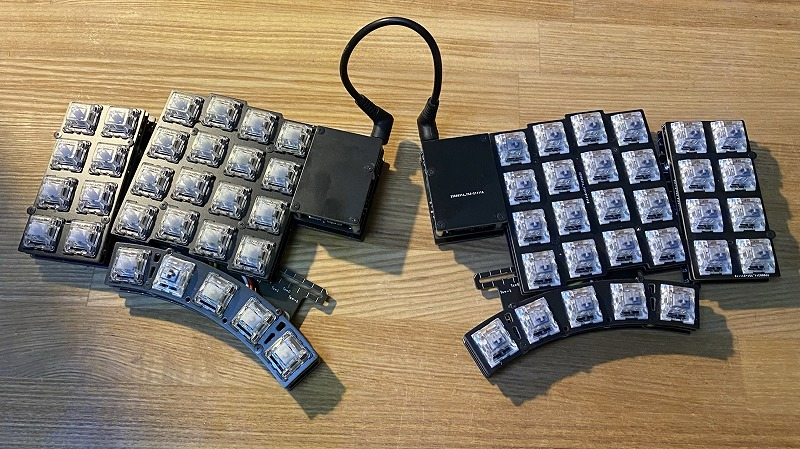
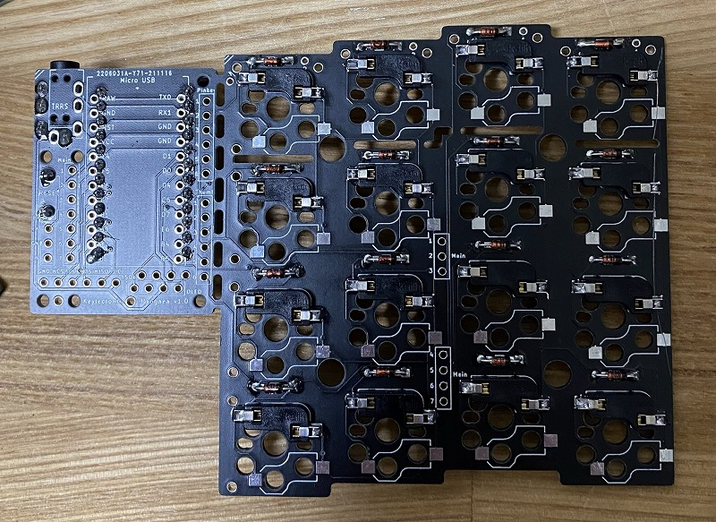
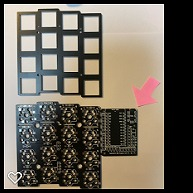
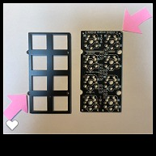
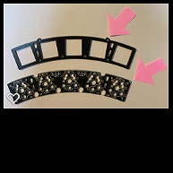
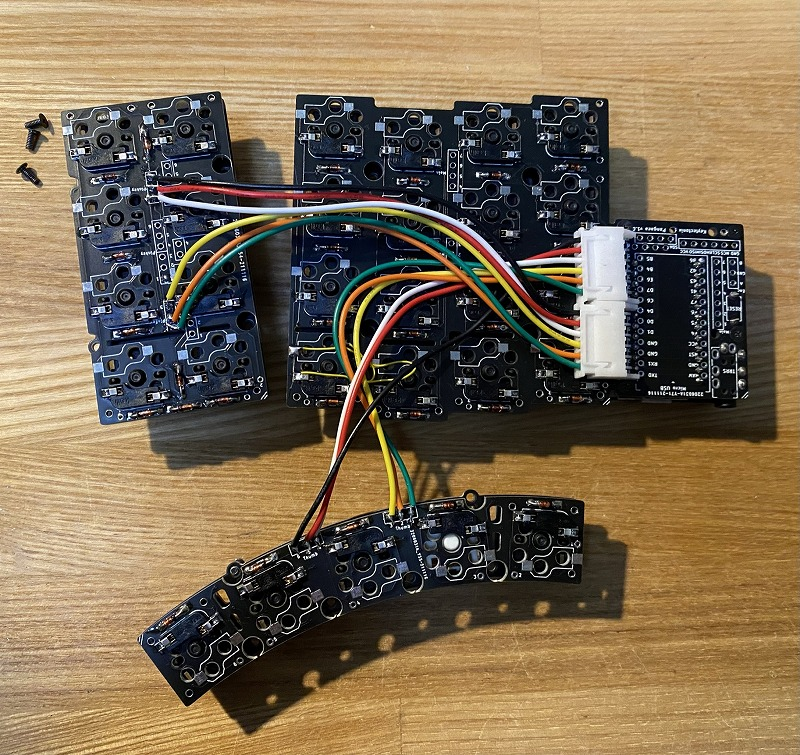
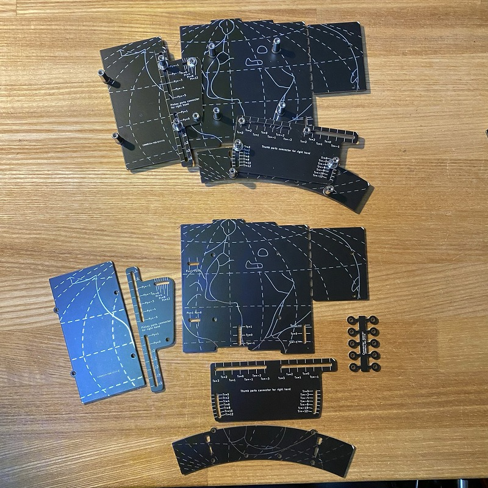

# Pangaea Build Guide for Beta Testers

<!-- TOC -->

- [Pangaea Build Guide for Beta Testers](#pangaea-build-guide-for-beta-testers)
  - [完成イメージ](#完成イメージ)
  - [組立編](#組立編)
    - [プレート毎の組み立て](#プレート毎の組み立て)
    - [プレート間の信号接続](#プレート間の信号接続)
    - [Pro Microの取り付け](#pro-microの取り付け)
    - [動作確認](#動作確認)
    - [ボトムプレートの組み立て](#ボトムプレートの組み立て)
    - [ボトムプレートへのPCB基板の取り付け](#ボトムプレートへのpcb基板の取り付け)
  - [調整編](#調整編)
    - [メインプレートの調整](#メインプレートの調整)
    - [親指プレートの調整](#親指プレートの調整)
    - [小指プレートの調整](#小指プレートの調整)
  - [拡張編](#拡張編)
    - [キーの追加](#キーの追加)
    - [ロータリーエンコーダの追加](#ロータリーエンコーダの追加)
    - [OLEDディスプレイの追加](#oledディスプレイの追加)
    - [マイコンボードの切り離し](#マイコンボードの切り離し)

<!-- /TOC -->

この文章は Panagea Keyboard を組み立てるための手引き書です。興味を持って頂いたテスター向けです。想定読者は自作キーボードキットを組み立てたことがある方になります。

<details>
<summary>自作キーボードを組み立てたことがない方や、組み立てに自信がない方は、この文章の先頭の ▶ をクリックしてみてください。
</summary>

> ここは折りたたまれていた内容です。
> より詳細な組み立てガイドはこのように折りたたまれた状態で提供しますので、必要に応じて展開してご覧ください。

</details>

## 完成イメージ

組み立てたときの様子です。まだキーキャップは取り付けられていない状態です。

  


Note: こちらは Pro Micro が PCB の上面に取り付けられている場合の写真となり、現在おすすめの実装とは異なります。現在の推奨の場合のほうが高さが抑えられてすっきりします。[写真は差し替え予定です]

<details>
<summary>Pangaea keyboard のコンセプトは White Paper で説明されています。[行頭の ▶ のクリックで詳細表示します]
</summary><div>

下記は引用です。

```text
what's pangaea?
// 何なのか

キーレイアウトをいくつかの部分 "島" に切り離し、それぞれの島の位置を自由に調整できるようにしたキーボードです。

// 何ができるのか

島を動かすことで、個人の好みや手の形（癖、体型）に合わせてキー配置を調整できます。 
```

</div>

White Paper 全文は[こちら](whitepaper_jp.md)です。

</details>

## 組立編

Pangaea Keyboard の特徴の一つは親指プレートと小指プレートの位置が調整できることです。つまり、ソフトウェアでどこのスイッチに何のキーを割り当てるか、という話ではなくて、親指の位置を少しずらしたい、角度を少し調整して自分の指にフィットさせたい、などの対応ができるようになっています。そのメカ的な調整機構のために部品は三つのプレートに分かれています。また組み立ての順番を間違えると取り返しがつかないなどの構成にはなっていないため気楽に進められます。

ダイオード、スイッチ、マイコンなどをハンダ付けてして、分割されている部品をケーブルで接続して、可動部品をネジ止めし、スイッチ、キーキャップを取り付けたら完成です。

用語を確認します。
写真のPCBは左上がメインプレート、右上が小指プレート、下が親指プレートです。

  

1.メインプレート (写真の右上)

- メインプレートは、QWERTY配列のキーで言うと上から2345/WERT/SDFG/XCVB の部分になります。

2.小指プレート   (写真の左)

- 小指プレートは、標準では8個のキーで構成されます。
- 将来、オプションで最も外側のキーが下方向に下がった部品も用意される予定です。

3.親指プレート   (写真の下)

- 親指プレートは、標準では5個のキーで構成されます。
- カスタマイズにより3個のキーあるいは4個のキーにキーの数を削減可能です。

Pangaea では上記の親指プレート、小指プレートの物理的な位置が調整できるようにするため、それぞれのプレートを接続するコネクタ部品が用意されています。組み立てにはプレート間を信号としても物理的にも接続する必要があります。

それでは順に組み立てていきましょう。

### プレート毎の組み立て

基板とプレート間を接続した完成形はこちらです。左手側です。

Note: 次の写真はProMicroが上面に取り付けられていますが、推奨は裏側への取り付けになります。TRRSもスイッチも裏が推奨です。理由は高さを抑えるためで、裏に取り付けるとスイッチプレートとほぼ同じ高さになります。

  

まずはプレート毎に組み立てていきます。基板の向きを間違えないようにするためのマークが PCB に印字されています。よく確認して右下に斜線のマークが来るように合わせましょう。

1.メインプレートの組み立て

- ダイオード

ダイオードの方向は、PCB上の白い線と、ダイオードの黒い線を合わせます。

  

表面実装向けの Surface Mount Device(SMD) のダイオードを利用する場合は、SMD の ダイオードの線とPCB の線の位置を合わせます。写真の例では、T4と書かれた左の線とPCBの線を合わせます。

  

  

- スイッチソケット
- Pro Micro
- Reset switch
- 3.5mm ジャック

左手用のメインプレートを裏から見た状態です。基板はいわゆるリバーシブルの設計となっていて、右手、左手でひっくり返して利用します。これから左を先に実装します。
[サメさんの写真に差し替える]

Note: Pro Micro, TRRS ジャック、Reset switch も裏側に取り付けます。

別の実装として、写真のようにPro Micro は上に取り付けることもできて、その場合上から見て左側の列に取り付けます。3.5mm ジャック、Reset Switch も取り付けます。

  


2.小指プレートの組み立て

- ダイオード
- スイッチソケット｀｀

ダイオードは縦方向にも取り付ける必要があります。キーの個数分の8個のダイオードが取り付けられているか確認します。個数を数えれば見逃しがないと思います。

  

3.親指プレートの組み立て

- ダイオード
- スイッチソケット

こんな感じになります。ダイオードの方向に間違いがないか今一度確認したほうがよいでしょう。

  

これで三つのプレートが用意できました。

それぞれトッププレートにスイッチを挿入し、PCB に固定します。それぞれのプレートのトッププレートの方向です。

  

  

  

### プレート間の信号接続

次にプレート同士の信号を接続します。

こちらが最終的に接続された状態です。

  

裏はこのようになっています。

  

Note: ※配線自体は間違いないのですが親指プレートが上下逆の配置となっています。機器のトラブルで写真が更新できない状況のためとりいそぎコメントを追記します。

1.メインと親指プレートの接続

XHコネクタを用いた場合の実装例です。高さを抑えるためにコネクタを使わずに直接、ワイヤをハンダ付けしてもかまいません。メイン基板と親指プレートを接続します。配線はそれぞれ1-6の番号を対応させます。あまりワイヤが短いと調整の時に引っ張ってしまって可動域に制約が出たり、ワイヤが切れたりします。少なくとも11cm程度の長さを確保したほうがよいです。余り長くても邪魔になりますのでボトムプレートと組み合わせて確認してみるとよいと思います。

2.メインと小指プレートの接続

XHコネクタを用いた場合の実装例です。こちたも直接ワイヤをハンダ付けしてもかまいません。最終的な基板のレイアウトを確認して自然な方向となるようにハンダ付けすると断線のリスクが下がると思います。

### Pro Microの取り付け

メインプレートPCBの裏側に取り付けます。
以下の写真のように、Pro Microの部品が実装されていない面が見えるようにコンスルーを取り付けた場合は、メインプレートPCB裏面シルクの白いラインに合わせて取り付けてください。

同様にTRS/TRRSジャックおよびタクトスイッチ（リセットスイッチ）をPCBの裏側に取り付けます。


注意：
ProMicroをPCBの裏側に取り付けることで表側がすっきりします。その代わりに、USBケーブルやTRS/TRRSケーブルのプラグが机と干渉しやすくなります。
お使いのUSBケーブルやTRS/TRRSケーブルを確認の上、机と干渉する場合は、ProMicroおよびTRS/TRRSジャックをPCBの表側に取り付けることを検討してください。
ProMicroをPCBの表側に取り付ける場合、PCBとProMicroカバープレートの間に挟むスタンドオフを6mmの物（オプション）に変更してください。

### 動作確認

この状態で Firmware を書き込んで動作を確認します。全て組み立ててからでもよいですが、配線にミスなどがあると再度分解することになります。自信がある方はここをスキップして、ボトムプレートの組み立てに進みましょう。

QMK の directory に移動してから、

```sh
cd qmk_firmware
```

ProMicro に firmware を書き込みます。Compileも一緒に行います。

```sh
qmk flash -kb pangaea -km default
```

一部のスイッチが入力できないなど問題があればハンダ付けをよく確認してください。原因として考えられることとしては下記です。

- ダイオードが取り付けられていない
- ダイオードの方向が逆に取り付けられている
- スイッチソケットを逆に取り付けていて、そもそもスイッチが刺さっていない
- スイッチソケットのハンダ付けが不十分で、接触不良
- スイッチの足が折れていて、正常にスイッチソケットに刺さっていない

そんなミスするわけない！などと言わずによく見てみましょう。

### ボトムプレートの組み立て

次にボトムプレートを組み立てます。完成形はこのようになります。これが Pangaeaたるゆえんです。小指プレート、親指プレートが自由に調整できる機構が組み込まれています。

部品をピンクの矢印のところにPCBのマークがくるように並べます。

  

  

まずは、メインのボトムプレートを用意し、4つのネジを固定します。これはメイン基板を固定するためのネジです。PCBのスペーサを使って高さを上げます。ネジは M2 6mm がいいでしょう。5mmだとギリギリで、8mm だと一部PCBに干渉して調整範囲に影響が出ます。

次に親指プレートのボトムプレートを用意し、メインプレートと接続します。
接続部品はこちらです。

  

スタンドオフは9mmを使用しています。コネクタを使わずに直接配線する場合には3−4mmでも大丈夫でしょう。手前側はPCBのスペーサを使って高さを上げます。ネジは6mmを使います。

最後に、小指プレートのボトムプレートを用意し、メインプレートと接続します。
接続部品はこちらです。

  

手前側はPCBのスペーサを使って高さを上げます。

それぞれの可動部分にはワッシャーとスプリングワッシャーを使うのがおすすめです。理由は組み立て後の稼働がスムーズになるためです。直接ネジ止めするとネジが緩みやすく、調整のためにドライバーでネジ止めすることになり不便に感じられると思います。ワッシャーとスプリングワッシャーを使うとある程度きつくネジを締めた状態で調整もできるため組み立て後の調整が楽になります。

こんな感じで調整できるようになっていると思います。動画です。

  

### ボトムプレートへのPCB基板の取り付け

ここまでできたら統合です。スイッチがついたメイン基板、親指プレート、小指プレートをボトムプレートの上に乗せてネジで固定します。固定箇所はメイン、親指プレート、小指プレートそれぞれが4箇所です。

![ [photo] 1](images/d52466fd30a9bd447ba011db17c6af2e1d6d6b381e681eb9b976b4c6a248406f.jpg)  

右側も同様に組み立てます。基板のマークが揃うように部品の方向に気をつけて組み立ててください。

  

キーキャップをはめて、左右をTRRSケーブルで接続したら完成です。

DROP の MT3 Black を取り付けたときの様子です。

  

## 調整編

Pangaea keyboard の価値の一つは位置を調整できることです。好きなように調整してください、なのですが、自由度が高すぎても困ると思いますので私の例で説明します。

まずこれが便利です。

PCB Wrench [Photo]

私の調整した結果を例として写真を掲載します。[PHOTO]

### メインプレートの調整

メインプレートはz軸方向の高さ調整が可能です。中心方向の2本のスタンドオフを高くし、中心に向かってチルトさせることができます。

またx軸、y軸方向の調整として左右のメインプレート間の調整用にscaleが用意されています。ある程度固定次第長さに切って使用するとよいでしょう。
[PHOTO]

- 左右の間隔調整
- 左右の角度調整

### 親指プレートの調整

親指プレートはx,y軸方向とz軸方向の調整ができます。
x,y軸方向はTy-=-1〜1 でかつTx =- -1〜3の範囲で調整できます。
また、z軸方向はスタンドオフの長さをメインプレートに比べて少し低くするといった工夫も可能です。親指プレートだけ choc にしてメインプレートに対して高さを抑えることもできます。例です。rev.2[PHOTO ]

### 小指プレートの調整

小指プレートは、左側であれば Pr=0〜12度の回転、Py=-5〜-1 の範囲で調整ができます。

## 拡張編

単純にテキスト入力だけなら標準キットで十分ですが、特定のアプリケーションやWeb会議などやはり専用のキーが欲しくなってりする場面が出てくると思います。
Pangaea は自由に拡張でき、かつ接続の標準インタフェースを定めているためパーツの交換が容易にできます。

ここではキーの追加、Rotary Encoder,OLED, Joy Stick, Dial switch の追加方法について説明します。

Pangaea の設計は e3w2q さんなのです。つまり SU120 の作者さんです。SU120 と組み合わせることで Function key や Rotary Encoder などを追加することができます。

作例はこちらです。Rev.2 での様子です。
[photo]

### キーの追加

キーを追加する方法です。

1. SU120を利用してキーの追加
2. QMK Firmware の対応

### ロータリーエンコーダの追加

ロータリーエンコーダを追加する方法です。

1. SU120を利用してロータリーエンコーダの追加
2. QMK Firmware の対応

### OLEDディスプレイの追加

OLEDディスプレイを追加する方法です。

1. OLEDディスプレイの取り付け
2. QMK Firmware の対応

### マイコンボードの切り離し

メインプレートにある Pro Micro 部分は切り離すことができます。内側にキーを追加したい場合やトラックボールを配置するなどこの部分が邪魔になる場合は切り離して、メインプレートとワイヤで配線することで別の場所に移動することができます。

[Photo]()

1. 切り離し
2. メインプレートとマイコンボードの配線

- 未検証
