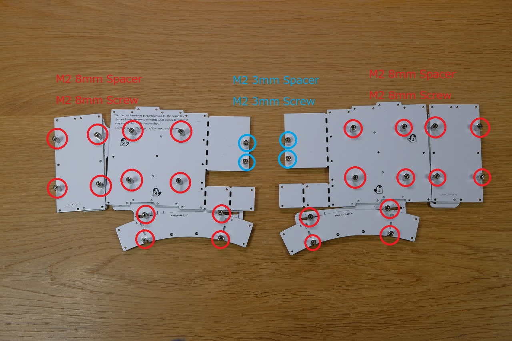
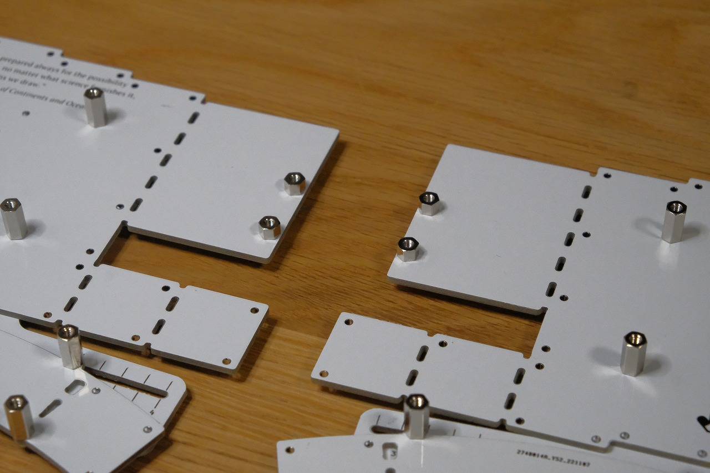

# Pangaea Keyboard Build Guide

この文章は Pangaea Keyboard を組み立てるための手引き書です。想定読者は自作キーボードキットを組み立てたことがある方になります。
自作キーボードを組み立てたことがない方や、組み立てに自信がない方は、「Tips」を展開して確認して下さい。

Pangaea keyboard のコンセプトは [White Paper](whitepaper_jp.md) で説明されています。

ファームウェアについては [ファームウェア](#ファームウェア) の節で説明しています。QMK Firmwareのソースコードは [こちら](firmware/) です。

Pangaea Keyboardには多彩なオプション機能があり、お好みの構成を選択して組み立てることができます。
このビルドガイドでは、標準的な構成の組み立て手順について説明します。
※オプション機能については [オプション機能](#オプション機能) を参照してください。

- [Pangaea Keyboard Build Guide](#pangaea-keyboard-build-guide)
  - [準備](#準備)
    - [構造の理解](#構造の理解)
    - [構成、オプションの選択](#構成オプションの選択)
    - [必要な部品の確認](#必要な部品の確認)
  - [組み立て](#組み立て)
    - [可動ボトムプレートの組み立て](#可動ボトムプレートの組み立て)
    - [各モジュールの組み立て](#各モジュールの組み立て)
      - [メインモジュールの組み立て](#メインモジュールの組み立て)
      - [小指モジュールの組み立て](#小指モジュールの組み立て)
      - [親指モジュールの組み立て](#親指モジュールの組み立て)
      - [キースイッチの取り付け](#キースイッチの取り付け)
    - [モジュールの合体](#モジュールの合体)
      - [モジュール間の信号接続](#モジュール間の信号接続)
      - [ボトムプレートとの結合](#ボトムプレートとの結合)
  - [ファームウェア](#ファームウェア)
    - [ファームウェアの書き込み](#ファームウェアの書き込み)
    - [動作確認](#動作確認)
  - [仕上げ](#仕上げ)
  - [調整](#調整)
    - [キー配列の調整](#キー配列の調整)
    - [キーマップの変更](#キーマップの変更)
  - [オプション機能](#オプション機能)
  - [さらなる改造](#さらなる改造)
    - [キーの追加](#キーの追加)
    - [ロータリーエンコーダの追加](#ロータリーエンコーダの追加)
    - [OLEDディスプレイの追加](#oledディスプレイの追加)


## 準備

組み立て作業の前に準備をします。

**準備** > [組み立て](#組み立て) > [ファームウェア](#ファームウェア) > [仕上げ](#仕上げ) > [調整](#調整)

* [構造の理解](#構造の理解)
* [構成オプションの選択](#構成オプションの選択)
* [必要な部品の確認](#必要な部品の確認)

### 構造の理解

構造と用語を確認します。

※ 以降、キーキャップの刻印面を上にしたとき、上側を表面、下側を裏面と呼びます。

キーボードを組み立てると写真のようになります。


Pangaea Keyboard の最大の特徴は、親指プレートと小指プレートの位置を動かせることです。
ソフトウェアでどこのスイッチに何のキーを割り当てるかだけでなく、物理的なキー配列を調整することができます。
例えば、親指の位置を少しずらしたい、角度を少し調整して自分の指にフィットさせたい、などの調整ができるようになっています。

Pangaea Keyboardは、そのメカ的な調整機構のために部品が3つのモジュールに分かれています。

* 中央の一番大きいものがメインモジュールです
* 左右両端の縦長の長方形が小指モジュールです
* 下の円弧状のものが親指モジュールです
* 間にあるスリットの空いたプレートは、ブリッジプレートと呼びます
* さらに、モジュール間で電気信号を伝えるためケーブルで接続します


### 構成、オプションの選択

Pangaea keyboardには様々なオプション機能があります。
このビルドガイドでは、標準的な構成の組み立て手順を説明します。
※オプション機能については [オプション機能](#オプション機能) を参照してください。

このビルドガイドで説明する標準構成は次の通りです。

* [x] MX互換スイッチを使用
* [x] スイッチソケットを使用
* [x] スルーホールダイオードを使用
* [x] LEDを実装（省略可）
* [x] ロータリーエンコーダーあり（省略可）
* [x] ProMicroをピンヘッダでPCBに直接はんだ付けして固定する
* [x] 縦向きの（普通の）リセットスイッチを使用する
* [x] ビルド済みのVIA対応ファームウェアを使用する
* [x] 親指キーは左右5個ずつ
* [x] 数字行、ロータリーエンコーダー、拡張キー、ProMicro部分を切り離さない
* [x] その他、追加の改造を行わない

標準構成と異なるオプションを選択した場合は、組み立て手順を読み替えて作業を進めてください。

### 必要な部品の確認

| 種類                                                  | 数量 | 備考                                                         |
| ----------------------------------------------------- | ---- | ------------------------------------------------------------ |
| --- 基板類 ---                                        |      |                                                              |
| メインモジュールPCB左手側                             | 1    |                                                              |
| メインモジュールPCB右手側                             | 1    |                                                              |
| メインモジュールスイッチプレート                      | 2    | 左右共通                                                     |
| メインモジュールボトムプレート                        | 2    | 左右共通                                                     |
| 小指モジュールPCB                                     | 2    | 左右共通                                                     |
| 小指モジュールスイッチプレート                        | 2    | 左右共通                                                     |
| 小指モジュールボトムプレート                          | 2    | 左右共通                                                     |
| 親指モジュールPCB                                     | 2    | 左右共通                                                     |
| 親指モジュールスイッチプレート                        | 2    | 左右共通                                                     |
| 親指モジュールボトムプレート                          | 2    | 左右共通                                                     |
| 小指ブリッジプレート                                  | 2    | 左右共通                                                     |
| 親指ブリッジプレート                                  | 2    | 左右共通                                                     |
| --- 電子部品類 ---                                    |      |                                                              |
| ProMicroまたは互換ボード                              | 2    | ATmega32U4                                                   |
| ピンヘッダー                                          | 4    | ProMicor付属の物                                             |
| タクトスイッチ                                        | 2*   | *省略可                                                      |
| 3.5mm TRRSジャック                                    | 2    |                                                              |
| ダイオード                                            | 60   |                                                              |
| スイッチソケット                                      | 60   |                                                              |
| MX互換キースイッチ                                    | 60   |                                                              |
| ロータリーエンコーダー                                | 2*   | *省略可                                                      |
| JST SH 4pinクロスケーブル長さ10cm                     | 2*   | メイン-ロータリーエンコーダー間接続用。*省略可               |
| JST SH 4pinクロスケーブル長さ10cm                     | 2    | メイン-小指モジュール間接続用                                |
| JST SH 4pinクロスケーブル長さ15cm                     | 2    | メイン-親指モジュール間接続用                                |
| JST SH 4pinコネクターレセプタクル表面実装サイドタイプ | 8    |                                                              |
| --- ネジ類 ---                                        |      |                                                              |
| M2両ネジ六角スペーサー長さ8mm                         | 24   | スイッチプレートの支持用。片手12個                           |
| M2両ネジスペーサー長さ3mm                             | 4    | ProMicro周りのPCB支持用。片手2個                             |
| M2両ネジスペーサー長さ6mm                             | 8    | ProMicroカバーの支持用。片手4個                              |
| M2ネジ長さ8mm                                         | 24   | ボトムプレートの固定。片手12本                               |
| M2ネジ長さ3mm                                         | 48   | スイッチプレートの固定、PCB支持、ProMicroカバー固定。片手24個 |
| --- 小物類 ---                                        |      |                                                              |
| USBケーブル                                           | 1    | Pro Micro互換ボードとPCを繋ぐ。                              |
| TRRSケーブル                                          | 1    | 左右のメインモジュールを繋ぐ。                               |
| キーキャップ                                          | 60   | すべて1Uサイズ。                                             |
| ゴム足 2.2mm厚                                        | 約10 | ブリッジプレートに貼る                                       |
| ゴム足 3.8mm厚                                        | 約20 | ボトムプレートに貼る                                         |

各部品の詳細な型番や入手先は[パーツリスト（BOM）](bom_list_jp)を参照してください。

SHケーブルは、両端のピンアサインが変わらないタイプを使用してください。


オプションの選択によって、必要な部品の種類や数が変わることがあります。
※オプション機能については [オプション機能](#オプション機能) を参照してください。

基板類をすべて並べた写真がこちらです。不足がないことを確認してください。


* メインモジュールPCBは、左右で部品が異なります。
* 小指モジュールと親指モジュールは、右手側と左手側で同じ物を使用します。
* メインモジュールスイッチプレート、メインモジュールボトムプレート、ブリッジプレートは、左右同じものを使用しますが、使用する向きが異なります
  * **裏面**から見たときにLマークが見えるほうが左手側、**裏面**から見たときにRマークが見えるほうが右手側になる向きで使用します。


## 組み立て

[準備](#準備) > **組み立て** > [ファームウェア](#ファームウェア) > [仕上げ](#仕上げ) > [調整](#調整)

* [可動ボトムプレートの組み立て](#可動ボトムプレートの組み立て)
* [メインモジュールの組み立て](#メインモジュールの組み立て)
* [小指モジュールの組み立て](#小指モジュールの組み立て)
* [親指モジュールの組み立て](#親指モジュールの組み立て)

組み立ての順番を間違えても取り返しがつかないようなことにはなりません。気楽に進めてください。

###  可動ボトムプレートの組み立て

最初に可動ボトムプレートを組み立てます。Pangaea Keyboardの醍醐味である可変機構をぜひ味わって下さい。

完成形は以下の写真のようになります。メインモジュールに対して、小指モジュール、親指モジュールが自由に調整できる機構が組み込まれています。  

組み立てに使用するネジとスペーサーの長さは、以下のようにします。


8mmのネジと8mmのスペーサーを赤丸の位置に取り付けます。裏側からネジ頭、ブリッジプレート、ボトムプレート、スペーサーの順で重ねます。




裏から見ると下の写真のようになっています。


ProMicro周りを支えるためのスペーサーの拡大図です。



<details>
<summary>Tips: ワッシャーの追加</summary>
<div>
組み立て後の稼働をよりスムーズにするため、可動部分にはワッシャーとスプリングワッシャーを使うことをおすすめします。直接ネジ止めするとネジが緩みやすく、調整のためにドライバーでネジ止めすることになり不便に感じられると思います。ワッシャーとスプリングワッシャーを使うことで、ある程度きつくネジを締めた状態でも可動できるようになるため、組み立て後の調整が楽になります。
 
</div>
</details>
### メインモジュールの組み立て

次に、各モジュールのPCBに部品を取り付けていきます。

メインモジュールには、以下の部品を取り付けます。

- [LED（オプション）](#LED（オプション）)
- [SHコネクタレセプタクル](#SHコネクタレセプタクル)
- [ダイオード](#ダイオード)
- [スイッチソケット](#スイッチソケット)
- [ProMicro](#ProMicro)
- [TRRSジャック](#TRRSジャック)
- [リセットスイッチ（オプション）](#リセットスイッチ（オプション）)

#### LED（オプション）

LEDをPCBの**裏**面にはんだ付けします。LEDは<u>光る面が表側</u>を向きます。
マイコン内蔵LEDは高温に弱いため、はんだごての温度を下げます。250℃以下にすることをおすすめします。

LEDは取り付ける向きが決まっています。
LEDの端子が斜めにカットされている足をPCBの三角形のマークに合わせます。（赤線部分）

 

#### SHコネクタレセプタクル

SHコネクタのレセプタクルをPCBの**裏**面にはんだ付けします。やや難しいので慎重に行います。
小指モジュール用、親指モジュール用のコネクタをそれぞれ取り付けます。

ロータリーエンコーダーを使用する場合は、ロータリーエンコーダー用のSHコネクタもはんだ付けします。

 

#### ダイオード

ダイオードをPCBの**裏**面にはんだ付けします。

ダイオードの方向は、PCB上の白い線（PCBが白地の場合は黒い線）と、ダイオードの黒い線を合わせます。

 

  

表面実装向けの Surface Mount Device(SMD) のダイオードを利用する場合は、SMD の ダイオードの線とPCB の線の位置を合わせます。写真の例では、T4と書かれた左の線とPCBの線を合わせます。

  


左手用のメインモジュールPCBを裏から見た状態です。これから左を先に実装します。

#### スイッチソケット

スイッチソケットも同様にPCBの**裏**側にはんだ付けします。

MX互換スイッチを用いる場合は上側にソケットを取り付けます。


#### Reset switchの取り付け

PCBの**表**側からはんだ付けします。

#### 3.5mm TRRSジャックの取り付け

PCBの**表**側からはんだ付けします。

#### Pro Microの取り付け

ProMicroをメインプレートPCBの**表側**に取り付けます。ProMicroの向きは実装面を下にします。つまり、ProMicroのつるつるの面が上を向き、ProMicroの色々部品がついている面は隠れる向きです。

※ コンスルーを使用する場合は、「ProMicro コンスルー 」で検索してみてください。遊舎工房の資料が分かりやすいです。[コンスルー（スプリングピンヘッダ）の取り付け方を教えて下さい – 遊舎工房サポートサイト (zendesk.com)](https://yushakobo.zendesk.com/hc/ja/articles/360044233974-コンスルー-スプリングピンヘッダ-の取り付け方を教えて下さい)

まず、ProMicro付属のピンヘッダーをPCBに差し込みます。短いほうを上にして、長いほうを差し込みます。


裏側はこのように飛び出します。


次に、ProMicroを上から重ねます。


ProMicroとピンヘッダーをはんだ付けします。隣り合ったピンとはんだがブリッジしないよう注意してください。


そして、裏側に飛び出したピンヘッダーをニッパーで短く切り、PangaeaのPCBとピンヘッダーをはんだ付けします。


※ピンヘッダーを切るときは、切れ端が飛ばないよう十分注意してください。


#### ProMicroを支える足をねじ止めする

M2 3mmのネジとM2 3mmのスペーサーを水色丸の位置に取り付けます。これはPCBのProMicro周辺部を支えるためのスペーサーです。後の工程でボトムプレートに接続されます。

 

#### ProMicroカバーの取り付け

M2 3mmのネジとM2 6mmスペーサーをPCBの**表側**に取り付けます。PCBの裏側からM2 3mmのネジを入れて固定してください。

Pro Microの上にカバープレートを重ねて、4箇所をM2 3mmのネジで固定します。
プレートには裏表がありますで、スペーサーと穴が重なる向きで取り付けてください。

 

#### ロータリーエンコーダーのはんだ付け（オプション）

ロータリーエンコーダーをはんだ付けします。
プッシュスイッチ付きの場合は、スイッチの端子もはんだ付けします。

 

これでメインモジュールPCBのはんだ付けが完了しました。


### 小指モジュールの組み立て

メインモジュールと同様に、以下の部品をはんだ付けします。

- SHコネクタレセプタクル
- ダイオード
- スイッチソケット

キーの個数分の8個のダイオードが取り付けられているか確認します。個数を数えれば見逃しがないと思います。


MX互換スイッチを用いる場合は、PCBに「Pinkey-MX」と書いてある場所にSHコネクタを取り付けます。
※chocスイッチを用いる場合は、「Pinkey-Choc」と書いてある場所にSHコネクタを取り付けてください。

### 親指モジュールの組み立て

メインモジュールと同様に、以下の部品をはんだ付けします。

- SHコネクタ
- ダイオード
- スイッチソケット

はんだ付けが終わると、次の写真のようになります。ダイオードの方向に間違いがないか再度確認してください。

  

以上で、メイン・小指・親指の三つのPCBプレートが用意できました。

### キースイッチの取り付け

各モジュールのトッププレートにキースイッチを挿入し、キースイッチの足をPCBのソケットに挿しこんで固定します。
ソケットに挿しこむ際にキースイッチの足が曲がらないよう、注意してください。

  
  

すべてのスイッチの足が曲がらずにソケットに入っていることを、裏側から観察して確認します。

  

### モジュールの合体

モジュールを合体していきます。

#### モジュール間の信号接続

プレート同士の信号をSHコネクタを用いて接続します。

メインモジュールにケーブルコネクタを接続します。
ロータリーエンコーダーを取り付けた場合は、ロータリーエンコーダーとProMicroを接続します。

ケーブルを絶縁テープ等でPCBに固定します。

ケーブルの反対側を小指モジュール、親指モジュールに接続します。


あまりワイヤが短いと調整の時に引っ張ってしまって可動域に制約が出たり、ワイヤが切れたりします。少なくとも10cm程度の長さを確保したほうがよいです。余り長くても邪魔になりますのでボトムプレートと組み合わせて確認してみるとよいと思います。

<details>
<summary>Tips: ケーブルの整理</summary>
<div>
ケーブルがPCBとボトムプレートの間にうまく収まらない場合は、テープでケーブルをPCBに固定してからボトムプレートを組み立ててください。

</div>
</details>

#### ボトムプレートとの結合

いよいよ、PCBとボトムプレートを統合していきます。スイッチがついたメインモジュール、親指モジュール、小指モジュールをボトムプレートの上に乗せてトッププレートの上からM2 3mmネジで固定します。

まず、メインモジュールをボトムプレートに取り付けます。

ボトムプレートのスペーサーをPCBの穴に通しやすくするため、ボトムプレートのネジを少し緩めてから重ねます。斜めにならず隙間なく重なったらスイッチプレートの表面からネジを入れて締めます。ネジを締めたら、先ほど緩めたボトムプレートの側のネジを締めなおします。
固定箇所は4箇所です。


小指モジュール、親指モジュールも同様にM2 3mmのネジで固定します。
固定箇所はそれぞれ4箇所です。


裏側です。


また、ボトムプレートとProMicroを支える足もM2 3mmのネジで固定します。ボトムプレートの下からM2 3mmのネジで2箇所を固定します。

右手側も同様に結合します。


## ファームウェア

[準備](#準備) > [組み立て](#組み立て) > **ファームウェア** > [仕上げ](#仕上げ) > [調整](#調整) ( > [オプション機能](#オプション機能) > [さらなる改造](#さらなる改造))

* [ファームウェアの書き込み](#ファームウェアの書き込み)
  * [QMK Toolboxを使って書き込む](#QMK Toolboxを使って書き込む)
  * [QMKコマンドを使って書き込む](#QMKコマンドを使って書き込む)

* [動作確認](#動作確認)

この状態でファームウェアを書き込んで動作を確認します。自信がある方はここをスキップして、完成してから実施しても構いません。

### ファームウェアの書き込み

下記いずれかの方法でファームウェアを書き込みます。

hexはremapからダウンロードしてください。

#### QMK Toolboxを使って書き込む

QMK Toolboxを使います。

QMK Toolboxでhexファイルを開きます。
キーボードを接続します。

リセットスイッチを押して、キーボードをブートローダーモードで再起動します。
成功してブートローダモードに入ると、QMK Toolboxに「～device connected」というメッセージが表示されます。

もしリセットスイッチを押してもブートローダモードにならない場合は、リセットスイッチを素早く2回押してみてください。

QML Toolboxの「Flush」ボタンをクリックします。
USBケーブルを抜かずに待機します。
QMK Toolboxの画面に成功の旨が表示されたら、書き込み成功です。USBケーブルを抜くことができます。

続いて、もう一つのPro Microにも同じ方法でファームウェアを書き込みます。
左右でファームウェアの違いはありません。

#### QMKコマンドを使って書き込む

QMK の directory に移動してから、

```sh
cd qmk_firmware
```

ProMicro に firmware を書き込みます。Compileも一緒に行います。

```sh
qmk flash -kb pangaea -km default
```

### 動作確認

ファームウェアの書き込みが完了したら、USBケーブルを抜いてから左右をTRRSケーブルで接続し、左側にだけUSBケーブルを接続します。
PCとキーボードをUSBケーブルで接続した状態でTRRSケーブルを抜き差ししないでください。TRRSジャックの端子がショートして、キーボードが故障する可能性があります。

PCで各キーの動作を確認します。

一部のスイッチが入力できないなど問題があればハンダ付けをよく確認してください。一部のキーだけが入力できない場合、原因として下記のようなことが考えられます。

- ダイオードが取り付けられていない
- ダイオードの方向が逆に取り付けられている
- スイッチソケットを逆に取り付けていて、そもそもスイッチが刺さっていない
- スイッチソケットのハンダ付けが不十分で、接触不良
- スイッチの足が折れていて、正常にスイッチソケットに刺さっていない

そんなミスするわけない！と思うかもしれませんが、よく見てみましょう。

動作確認が終わったら、USBケーブルとTRRSケーブルを取り外してから、残りの組み立て作業に戻ります。

## 仕上げ

[準備](#準備) > [組み立て](#組み立て) > [ファームウェア](#ファームウェア) > [仕上げ](#仕上げ) > [調整](#調整)


### ゴム足の取り付け

ボトムプレートの裏側にゴム足を貼り付けます。ゴム足の厚さは3.8mmがキーボード全体に余計な厚みが出ないベストなサイズです。

ゴム足の位置に決まりはありませんが、写真のようにプレートの四隅に貼り付けるとバランスが取れて良いでしょう。

  

可動範囲を確認しながら、可動の邪魔にならない位置に貼り付けてください。
以下は、v.1.2の例です。

  

さらなる安定を求める場合は、ブリッジプレートに2.2mm厚のゴム足を追加してください。
1.6mm厚のブリッジプレートと2.2mm厚のゴム足を合計した高さが、ちょうどボトムプレートの3.8mm厚のゴム足と同じ高さになります。

  


### キーキャップの取り付け

キーキャップをはめます。ロータリーエンコーダーを取り付けた場合はノブもはめます。

### TRRSケーブルの接続

左右をTRRSケーブルで接続します。

必ずTRRSケーブルを接続した後にキーボードとPCをUSBケーブルで接続してください。
TRRSケーブルを抜く前にも、必ずキーボードとPCの接続を外してください。

### 完成！

完成です。お疲れ様でした！

Polycaps Sealsを取り付けたときの様子です。


DROP の MT3 Black を取り付けたときの様子です。

  

## 調整

[準備](#準備) > [組み立て](#組み立て) > [ファームウェア](#ファームウェア) > [仕上げ](#仕上げ) > [調整](#調整)  ( > [オプション機能](#オプション機能) > [さらなる改造](#さらなる改造))

* [キー配列の調整](#キー配列の調整)
* [キーマップの変更](#キーマップの変更)

### キー配列の調整

Pangaea keyboard の価値の一つは位置を調整できることです。好きなように調整してください、なのですが、自由度が高すぎても困ると思いますので私の例で説明します。

私の調整した結果を例として写真を掲載します。[PHOTO]

### メインプレートの調整

またx軸、y軸方向の調整として左右のメインプレート間の調整用にscaleが用意されています。ある程度固定次第長さに切って使用するとよいでしょう。
[PHOTO]

- 左右の間隔調整
- 左右の角度調整

### 親指プレートの調整

親指モジュールは、横方向の位置と回転角度を調整できます。
調整可能範囲は、横位置は±0.0U～+1U、回転は親指先側が下に回る方向に0°～30°です。

### 小指プレートの調整

小指プレートは、縦方向の位置と回転角度を調整できます。

調整可能範囲は、縦位置は+0.25U～-1.25U、回転は上側が外に回る方向に0°〜18°です。

## キーマップの変更

上記手順で書き込んだファームウェアは、VIAおよび[Remap (remap-keys.app)](https://remap-keys.app/)によるキーマップ変更に対応しています。

各ソフトの説明にしたがってキーマップを設定してください。

## オプション機能

標準キットのオプション機能を説明します。

* [Kailh Choc v1スイッチの使用](#Kailh Choc v1スイッチの使用)
* [スイッチソケットを使用せずキースイッチを直接PCBにはんだ付けする](#スイッチソケットを使用せずキースイッチを直接PCBにはんだ付けする)
* [高さの調整](#高さの調整)
* [チルトとテント](#チルトとテント)
* [テープLEDの追加](#テープledの追加)
* [数字行の削除](#数字行の削除)
* [ロータリーエンコーダーの実装](#ロータリーエンコーダーの実装)
* [ロータリーエンコーダーの削除](#ロータリーエンコーダーの削除)
* [拡張キーの削除](#拡張キーの削除)
* [マイコンボード周辺部分の切り離し](#マイコンボード周辺部分の切り離し)
* [互換モジュールの使用](#互換モジュールの使用)

### Kailh Choc v1スイッチの使用

追加で必要な部品：Kailh Choc v1スイッチ用ソケット、Kailh Choc v1スイッチ

MX互換スイッチを使用する場合と比べて、次の点が変わります。

* ソケットの種類、取り付け向き

* 使用するスペーサー、ネジの長さ

### スイッチソケットを使用せずキースイッチを直接PCBにはんだ付けする

キースイッチの足とPCBの穴の間にはんだを大量に流し込むことで、スイッチソケットを使用せずにキースイッチを付けることができます。

スイッチプレートをつけ忘れないよう注意してください。

### 高さの調整

スペーサーの長さを変えることで、モジュールごとに高さを調整できます。

例えば、メインモジュールと小指モジュールのスペーサーを長いものに変更すると、親指モジュールだけを相対的に低くすることができます。

また、z軸方向はスタンドオフの長さをメインプレートに比べて少し低くするといった工夫も可能です。親指プレートだけ choc にしてメインプレートに対して高さを抑えることもできます。例です。rev.2[PHOTO ]

### チルトとテント

長さの異なるスペーサーを組み合わせることで、各モジュールのチルト、テント角度の調整ができます。

例えば、メインプレートはz軸方向の高さ調整が可能です。中心方向の2本のスタンドオフを高くし、中心に向かってチルトさせることができます。

PCBやプレートに負荷がかかるので、ネジを強く締めすぎないように気を付けてください。

### テープLEDの追加

追加で必要な部品 ：テープLED

テープLEDを追加できます。

NeoPixcelの代わりにテープLEDを追加することも、NeoPixelとテープLEDの両方を実装することもできます。

標準ファームウェアでは6個のLEDを使用できます。テープLEDを使用するときはLEDが6個になるようにテープLEDを切断して使用してください。

### 数字行の削除

メインモジュール、小指モジュールのキー数を4行から3行に変更できます。
行を減らすには、スイッチプレートおよびPCBを切断します。

元に戻せないので慎重に判断してください。

### ロータリーエンコーダーの実装

ロータリーエンコーダーを使えるようにします。

SHコネクタでProMicroの裏とロータリーエンコーダーを接続します。

### ロータリーエンコーダーの削除

メインモジュールのロータリーエンコーダーを削除できます。
ロータリーエンコーダーを削除するには、スイッチプレート、PCB、およびボトムプレートを切断します。

元に戻せないので慎重に判断してください。

### 拡張キーの削除

メインモジュールのロータリーエンコーダーの隣にある拡張キーを削除できます。
拡張キーを削除するには、スイッチプレート、PCB、およびボトムプレートを切断します。

元に戻せないので慎重に判断してください。

拡張キーを削除するとロータリーエンコーダーも同時に削除されます。
ロータリーエンコーダーを使用して拡張キーを使用しない場合は、拡張キーを切り離さずにキースイッチを取り外す等で対応してください。

### マイコンボード周辺部分の切り離し

メインモジュールにある Pro Micro 部分は切り離すことができます。内側にキーを追加したい場合やトラックボールを配置するなどこの部分が邪魔になる場合は切り離して、メインプレートとワイヤで配線することで別の場所に移動することができます。

[Photo]()

1. 切り離し
2. メインプレートとマイコンボードの配線

 ###  互換モジュールの使用

各モジュールをPangaea keyboardと同じ規格で設計された物に入れ替えたり、モジュールを追加したりできます。

将来、モジュールの最も外側のキーが下方向に下がった部品も用意される予定です。

自分で互換モジュールを設計することも可能です。

※ 互換モジュールの設計については、「設計者向けガイド（執筆中）」を参照してください。不明点等はPangaea開発チームに問い合わせてください。

## さらなる改造

単純にテキスト入力だけなら標準キットで十分ですが、特定のアプリケーションやWeb会議などやはり専用のキーが欲しくなってりする場面が出てくると思います。
Pangaea は自由に拡張でき、かつ接続の標準インタフェースを定めているためパーツの交換が容易にできます。

ここではキーの追加、Rotary Encoder,OLED, Joy Stick, Dial switch の追加方法について説明します。

Pangaea の設計者は e3w2q さんです。e3w2qさんの有名な作品にSU120があります。SU120 と組み合わせることで Function key や Rotary Encoder などを追加することができます。

作例はこちらです。Rev.2 での様子です。
[photo]

### キーの追加

キーを追加する方法です。

1. SU120を利用してキーの追加
2. QMK Firmware の対応

### ロータリーエンコーダの追加

ロータリーエンコーダを追加する方法です。

1. SU120を利用してロータリーエンコーダの追加
2. QMK Firmware の対応

### OLEDディスプレイの追加

OLEDディスプレイを追加する方法です。

1. OLEDディスプレイの取り付け
2. QMK Firmware の対応

---

以上。

目次: [準備](#準備) > [組み立て](#組み立て) > [ファームウェア](#ファームウェア) > [仕上げ](#仕上げ) > [調整](#調整)  ( > [オプション機能](#オプション機能) > [さらなる改造](#さらなる改造) )