# Pangaea Build Guide for Beta Testers

<!-- TOC -->

- [Pangaea Build Guide for Beta Testers](#pangaea-build-guide-for-beta-testers)
  - [完成イメージ](#完成イメージ)
  - [組立編](#組立編)
    - [部品の確認](#部品の確認)
      - [1.メインプレート (写真の右上)](#1メインプレート-写真の右上)
      - [2.小指プレート   (写真の左)](#2小指プレート---写真の左)
      - [3.親指プレート   (写真の下)](#3親指プレート---写真の下)
    - [ボトムプレートの組み立て](#ボトムプレートの組み立て)
    - [プレート毎の組み立て](#プレート毎の組み立て)
      - [1.メインプレートの組み立て](#1メインプレートの組み立て)
      - [2.小指プレートの組み立て](#2小指プレートの組み立て)
      - [3.親指プレートの組み立て](#3親指プレートの組み立て)
    - [キースイッチの取り付け](#キースイッチの取り付け)
    - [プレート間の信号接続](#プレート間の信号接続)
      - [1.メインと親指プレートの接続](#1メインと親指プレートの接続)
      - [2.メインと小指プレートの接続](#2メインと小指プレートの接続)
    - [Reset switchの取り付け](#reset-switchの取り付け)
    - [3.5mmジャックの取り付け](#35mmジャックの取り付け)
    - [Pro Microの取り付け](#pro-microの取り付け)
    - [動作確認](#動作確認)
    - [ボトムプレートへのPCBの取り付け](#ボトムプレートへのpcbの取り付け)
    - [ProMicroカバーの取り付け](#promicroカバーの取り付け)
    - [キーキャップの取り付け](#キーキャップの取り付け)
  - [調整編](#調整編)
    - [メインプレートの調整](#メインプレートの調整)
    - [親指プレートの調整](#親指プレートの調整)
    - [小指プレートの調整](#小指プレートの調整)
  - [拡張編](#拡張編)
    - [キーの追加](#キーの追加)
    - [ロータリーエンコーダの追加](#ロータリーエンコーダの追加)
    - [OLEDディスプレイの追加](#oledディスプレイの追加)
    - [マイコンボードの切り離し](#マイコンボードの切り離し)

<!-- /TOC -->

この文章は Panagea Keyboard を組み立てるための手引き書です。興味を持って頂いたテスター向けです。想定読者は自作キーボードキットを組み立てたことがある方になります。

<details>
<summary>自作キーボードを組み立てたことがない方や、組み立てに自信がない方は、この文章の先頭の ▶ をクリックしてみてください。
</summary>

> ここは折りたたまれていた内容です。
> より詳細な組み立てガイドはこのように折りたたまれた状態で提供しますので、必要に応じて展開してご覧ください。

</details>

## 完成イメージ

組み立てたときの様子です。まだキーキャップは取り付けられていない状態です。


<details>
<summary>Pangaea keyboard のコンセプトは White Paper で説明されています。[行頭の ▶ のクリックで詳細表示します]
</summary><div>
下記は引用です。

```text
what's pangaea?
// 何なのか

キーレイアウトをいくつかの部分 "島" に切り離し、それぞれの島の位置を自由に調整できるようにしたキーボードです。

// 何ができるのか

島を動かすことで、個人の好みや手の形（癖、体型）に合わせてキー配置を調整できます。 
```

</div>

White Paper 全文は[こちら](whitepaper_jp.md)です。

</details>

## 組立編

Pangaea Keyboard の最大の特徴は、親指プレートと小指プレートの位置を動かせることです。ソフトウェアでどこのスイッチに何のキーを割り当てるかだけでなく、物理的なキー配列を調整することができます。例えば、親指の位置を少しずらしたい、角度を少し調整して自分の指にフィットさせたい、などの調整ができるようになっています。そのメカ的な調整機構のために部品は三つのプレートに分かれています。また組み立ての順番を間違えると取り返しがつかないなどの構成にはなっていないため気楽に進められます。

ダイオード、スイッチ、マイコンなどをハンダ付けてして、分割されている部品をケーブルで接続して、可動部品をネジ止めし、スイッチ、キーキャップを取り付けたら完成です。

### 部品の確認

用語を確認します。  
PCBは3種類あります。写真右上の一番大きいものがメインプレート、写真左の縦長の長方形が小指プレート、写真下の円弧状のものが親指プレートです。

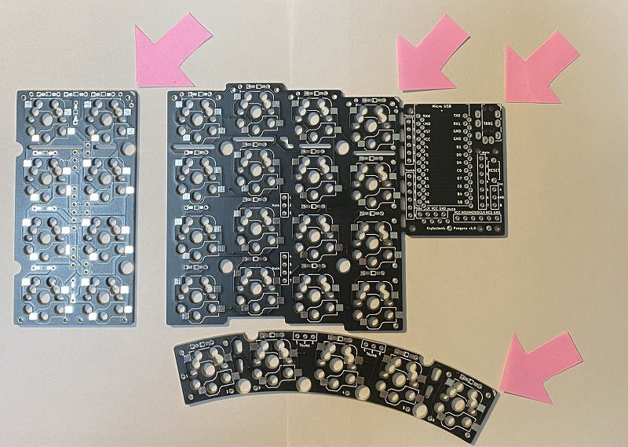  

基板はいわゆるリバーシブルの設計となっていて、右手、左手でひっくり返して利用します。

#### 1.メインプレート (写真の右上)

- メインプレートは、QWERTY配列のキーで言うと上から2345/WERT/SDFG/XCVB の部分になります。

#### 2.小指プレート   (写真の左)

- 小指プレートは、標準では8個のキーで構成されます。
- 将来、オプションで最も外側のキーが下方向に下がった部品も用意される予定です。

#### 3.親指プレート   (写真の下)

- 親指プレートは、標準では5個のキーで構成されます。
- カスタマイズ（拡張編で後述）により3個のキーあるいは4個のキーにキーの数を変更可能です。

親指プレート、小指プレートの配置を自由に調整できるようにするため、それぞれのプレートをスリットの入った接続プレートを介して接続します。さらに、プレート間で電気信号を伝えるためのケーブルを接続する必要があります。

それでは順に組み立てていきましょう。

### ボトムプレートの組み立て

最初にボトムプレートを組み立てます。完成形は以下の写真のようになります。小指プレート、親指プレートが自由に調整できる機構が組み込まれています。

左手側を組み立てる場合、ピンク色の矢印が指すように、プレートの端の斜線マークが右上になるように部品を並べます。

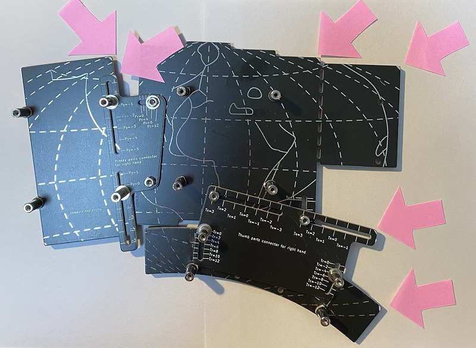  

ボトムプレートの組み立てに使用するスタンドオフの長さは、穴の位置によって異なります。以下のようにです。

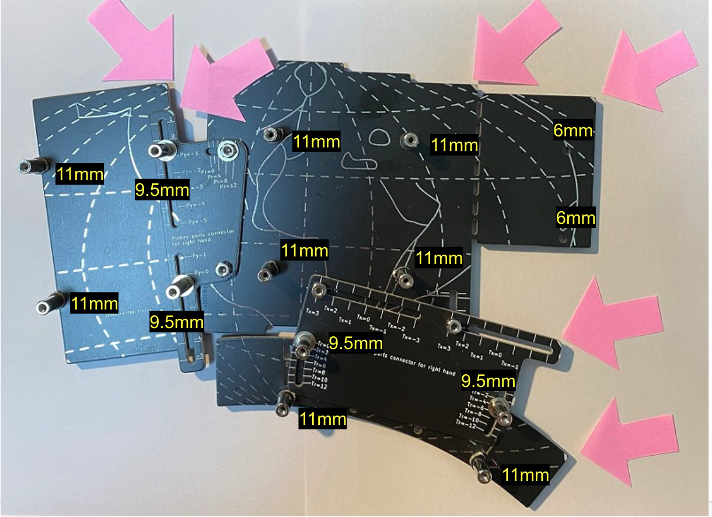  

まず、M2 6mmネジ、11mmスペーサーをメインのボトムプレート中央付近の4箇所に固定します。これはメイン基板を固定するための柱になります。
ネジは M2 6mm がいいでしょう。5mmだとギリギリで、8mm だと一部PCBに干渉して調整範囲に影響が出ます。

次に親指プレートのボトムプレートを用意し、メインプレートと接続します。
接続部品はこちらです。

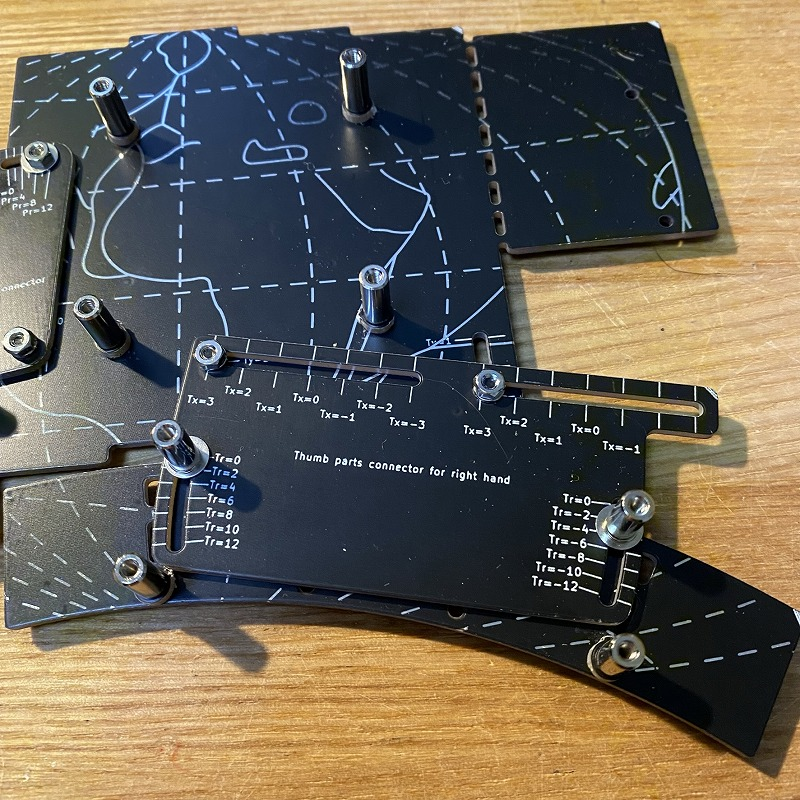  

スタンドオフは11mmを使用しています。コネクタを使わずに直接配線する場合には3−4mmでも大丈夫でしょう。ネジは6mmを使います。

最後に、小指プレートのボトムプレートを用意し、メインプレートと接続します。
接続部品はこちらです。

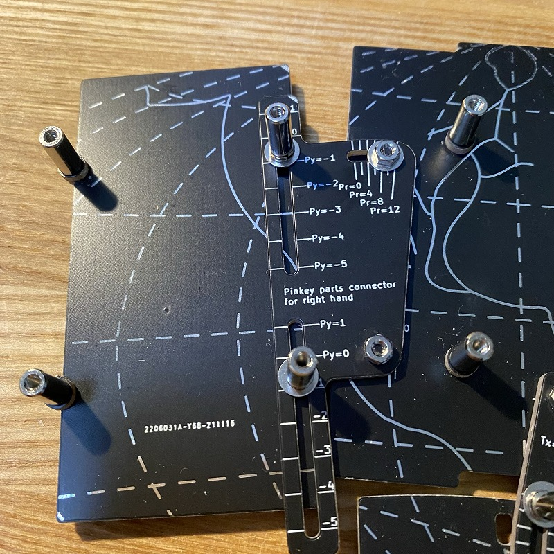  

Tips: 組み立て後の稼働をよりスムーズにするため、可動部分にはワッシャーとスプリングワッシャーを使うことをおすすめします。直接ネジ止めするとネジが緩みやすく、調整のためにドライバーでネジ止めすることになり不便に感じられると思います。ワッシャーとスプリングワッシャーを使うことで、ある程度きつくネジを締めた状態でも可動できるようになるため、組み立て後の調整が楽になります。

こんな感じで調整できるようになっていると思います。動画です。

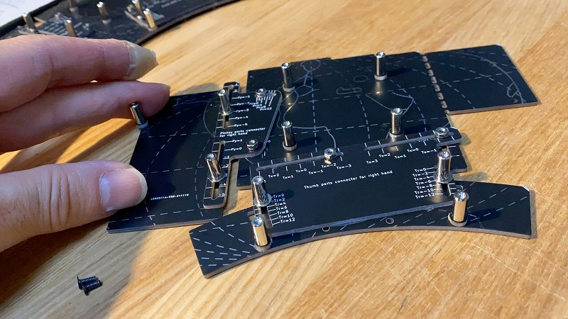  

### プレート毎の組み立て

基板とプレート間を接続した完成形はこちらです。左手側です。

Note: 次の写真はProMicroが上面に取り付けられていますが、推奨は裏側への取り付けになります。TRRSもスイッチも裏が推奨です。理由は高さを抑えるためで、裏に取り付けるとスイッチプレートとほぼ同じ高さになります。

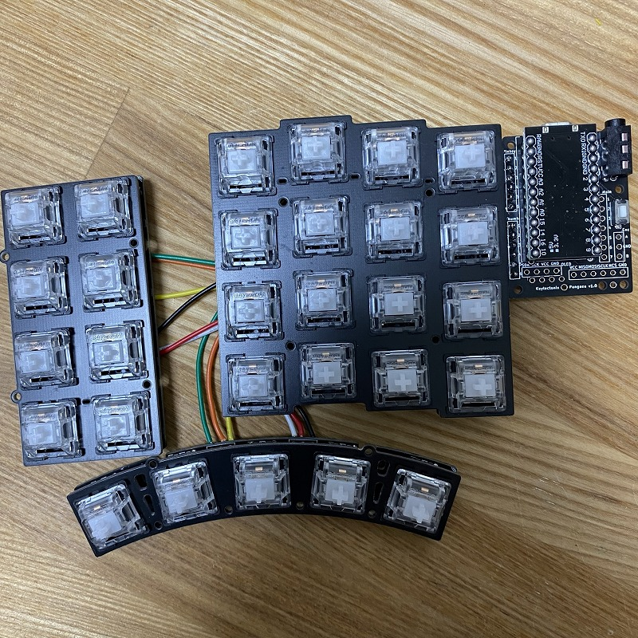  

#### 1.メインプレートの組み立て

まずはプレート毎に組み立てていきます。基板の向きを間違えないようにするためのマークが PCB に印字されています。

左手側のメインプレートは、**右上に三重線の印**があります。

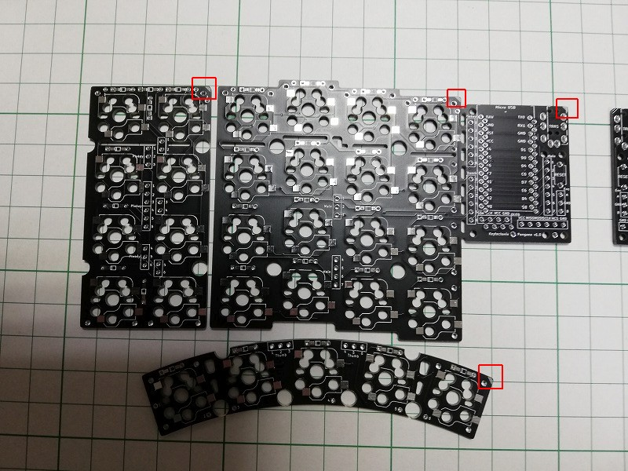

右手側のメインプレートは、**左上に二重線の印**があります。

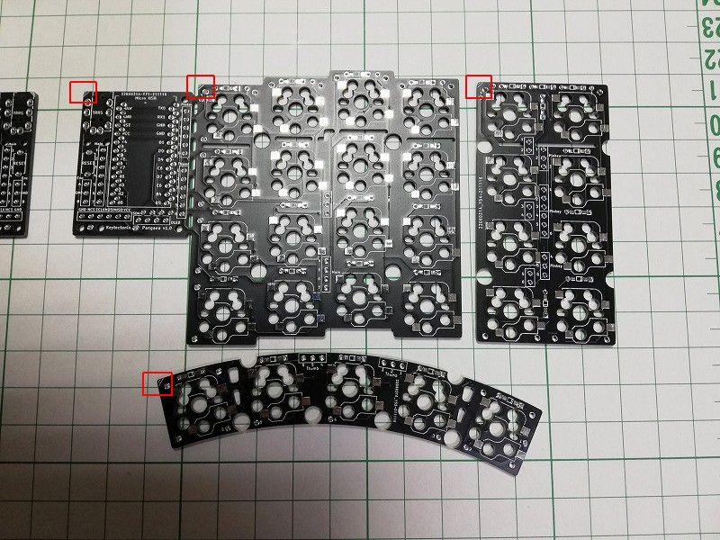

この後の作業は基本的に裏側に部品を付けていくため、表側にマスキングテープ等で印を付けておくことをお勧めします。

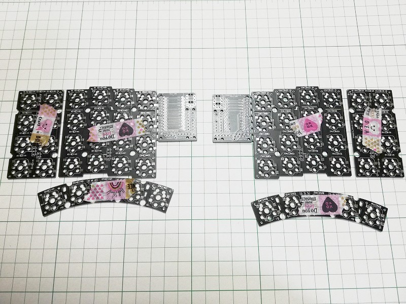

- ダイオード

ダイオードの方向は、PCB上の白い線と、ダイオードの黒い線を合わせます。

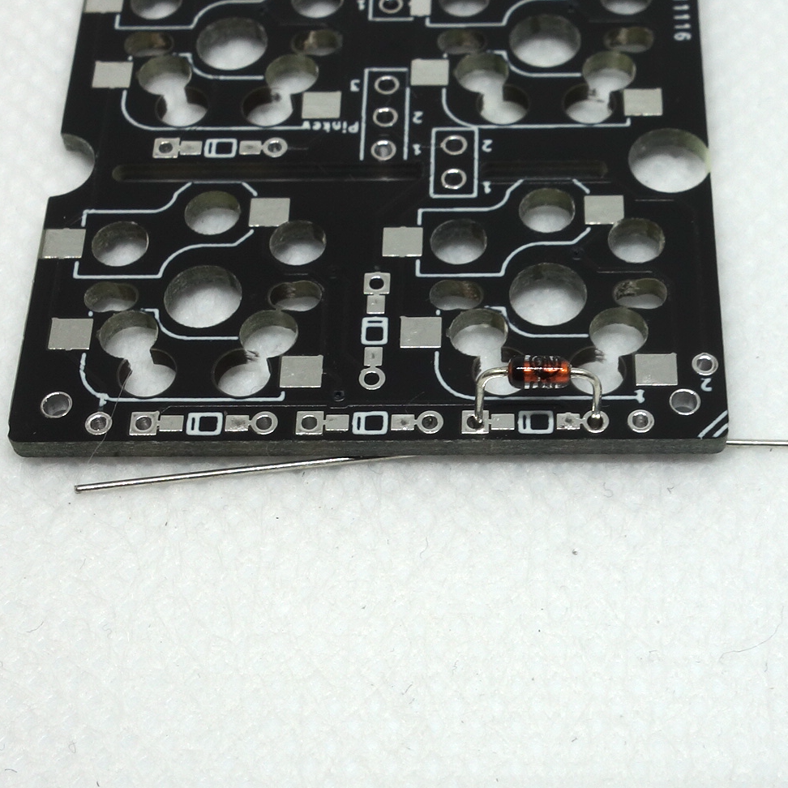  

表面実装向けの Surface Mount Device(SMD) のダイオードを利用する場合は、SMD の ダイオードの線とPCB の線の位置を合わせます。写真の例では、T4と書かれた左の線とPCBの線を合わせます。

  


左手用のメインプレートを裏から見た状態です。基板はいわゆるリバーシブルの設計となっていて、右手、左手でひっくり返して利用します。これから左を先に実装します。


- スイッチソケット

スイッチソケットも同様にはんだ付けします。

次の写真は、左手用のメインプレートを裏から見た状態です。

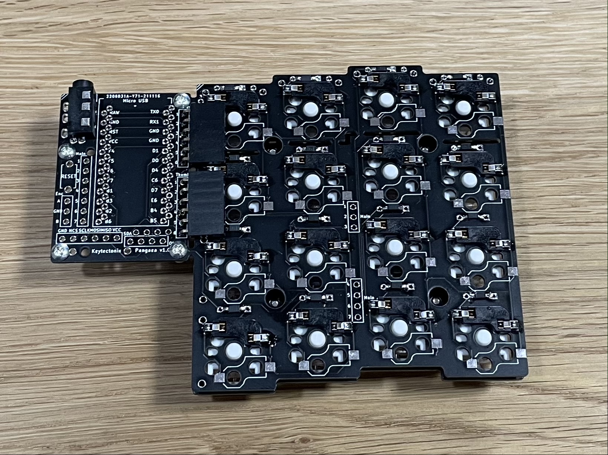

#### 2.小指プレートの組み立て

- ダイオード
- スイッチソケット

ダイオードは縦方向にも取り付ける必要があります。キーの個数分の8個のダイオードが取り付けられているか確認します。個数を数えれば見逃しがないと思います。

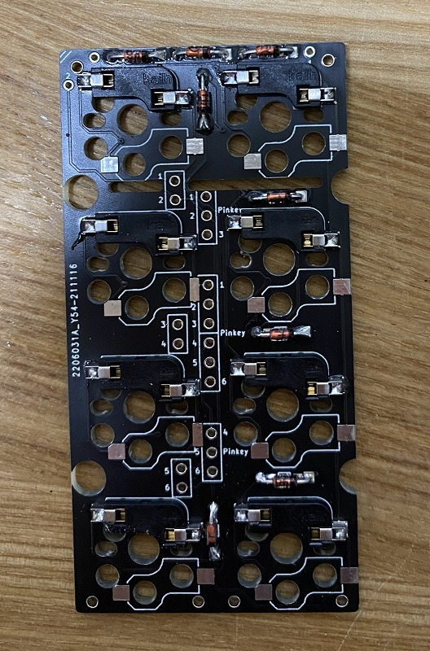  

#### 3.親指プレートの組み立て

- ダイオード
- スイッチソケット

をはんだ付けします。
はんだ付けが終わると、次の写真のようになります。ダイオードの方向に間違いがないか再度確認してください。。

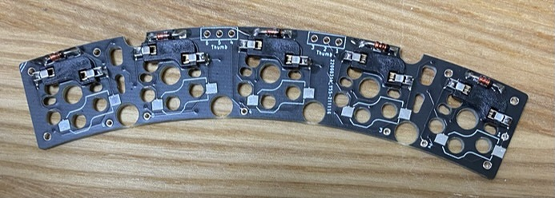  

以上で、メイン・小指・親指の三つのPCBプレートが用意できました。

### キースイッチの取り付け

それぞれトッププレートにキースイッチを挿入し、キースイッチの足をPCBのソケットに挿しこんで固定します。
ソケットに挿しこむ際にキースイッチの足が曲がらないよう、注意してください。

### プレート間の信号接続

次にプレート同士の信号を接続します。

こちらが最終的に接続された状態です。

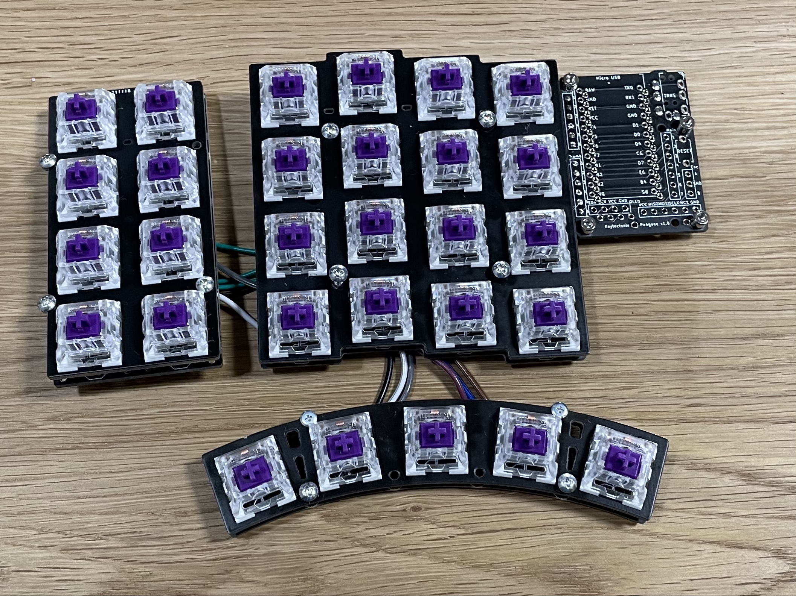

裏はこのようになっています。


#### 1.メインと親指プレートの接続

XHコネクタを用いた場合の実装例です。高さを抑えるためにコネクタを使わずに直接、ワイヤをハンダ付けしてもかまいません。メイン基板と親指プレートを接続します。配線はそれぞれ1-6の番号を対応させます。あまりワイヤが短いと調整の時に引っ張ってしまって可動域に制約が出たり、ワイヤが切れたりします。少なくとも11cm程度の長さを確保したほうがよいです。余り長くても邪魔になりますのでボトムプレートと組み合わせて確認してみるとよいと思います。

#### 2.メインと小指プレートの接続

XHコネクタを用いた場合の実装例です。こちたも直接ワイヤをハンダ付けしてもかまいません。最終的な基板のレイアウトを確認して自然な方向となるようにハンダ付けすると断線のリスクが下がると思います。


Note: Pro Micro, TRRS ジャック、Reset switch も裏側に取り付けます。

Tips: 別の実装として、Pro Micro はPCBの表側に取り付けることもできます。その場合、表側から見た時にシルクの長方形がPro Microの外形に重なるようにPro Microを取り付けます。同様に、3.5mm ジャック、Reset Switch も表側に取り付けます。


### Reset switchの取り付け

PCBの裏側からはんだ付けします。

### 3.5mmジャックの取り付け

PCBの裏側からはんだ付けします。

### Pro Microの取り付け

メインプレートPCBの裏側に取り付けます。
以下の写真のように、Pro Microの部品が実装されていない面が見えるようにコンスルーを取り付けた場合は、メインプレートPCB裏面シルクの白いラインに合わせて取り付けてください。

同様にTRS/TRRSジャックおよびタクトスイッチ（リセットスイッチ）をPCBの裏側に取り付けます。


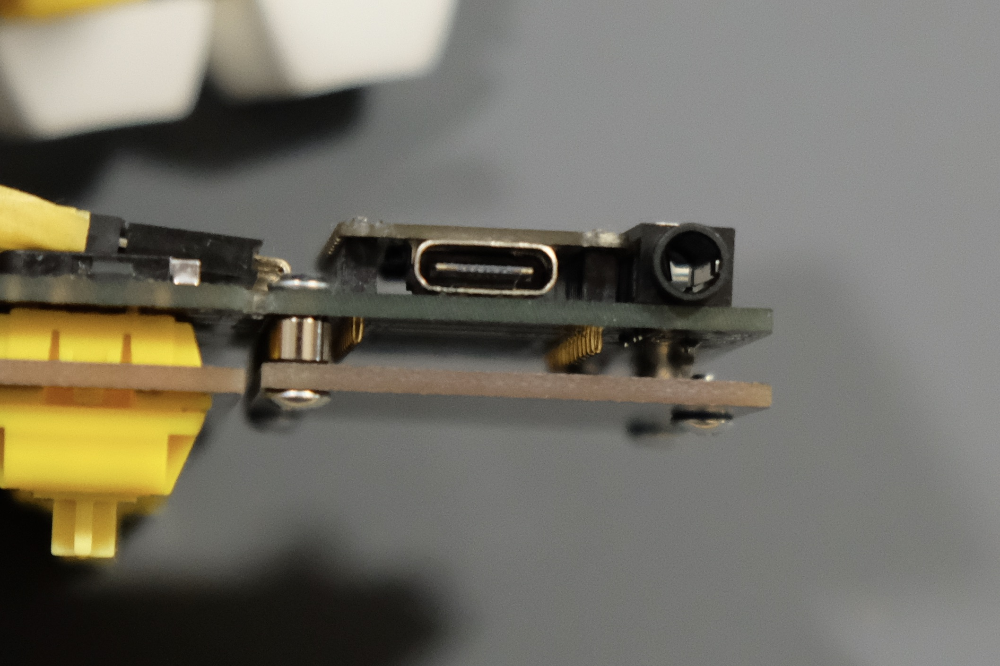

注意：
ProMicroをPCBの裏側に取り付けることで表側がすっきりします。その代わりに、USBケーブルやTRS/TRRSケーブルのプラグが机と干渉しやすくなります。
お使いのUSBケーブルやTRS/TRRSケーブルを確認の上、机と干渉する場合は、ProMicroおよびTRS/TRRSジャックをPCBの表側に取り付けることを検討してください。
ProMicroをPCBの表側に取り付ける場合、PCBとProMicroカバープレートの間に挟むスタンドオフを6mmの物（オプション）に変更してください。

### 動作確認

この状態で Firmware を書き込んで動作を確認します。全て組み立ててからでもよいですが、配線にミスなどがあると再度分解することになります。自信がある方はここをスキップして、ボトムプレートの組み立てに進みましょう。

QMK の directory に移動してから、

```sh
cd qmk_firmware
```

ProMicro に firmware を書き込みます。Compileも一緒に行います。

```sh
qmk flash -kb pangaea -km default
```

一部のスイッチが入力できないなど問題があればハンダ付けをよく確認してください。一部のキーだけが入力できない場合、原因として下記のようなことが考えられます。

- ダイオードが取り付けられていない
- ダイオードの方向が逆に取り付けられている
- スイッチソケットを逆に取り付けていて、そもそもスイッチが刺さっていない
- スイッチソケットのハンダ付けが不十分で、接触不良
- スイッチの足が折れていて、正常にスイッチソケットに刺さっていない

そんなミスするわけない！と思うかもしれませんが、よく見てみましょう。

### ボトムプレートへのPCBの取り付け

いよいよ、PCBとボトムプレートを統合していきます。スイッチがついたメイン基板、親指プレート、小指プレートをボトムプレートの上に乗せてネジで固定します。固定箇所はメイン、親指プレート、小指プレートそれぞれが4箇所です。

![ [photo] 1](images/d52466fd30a9bd447ba011db17c6af2e1d6d6b381e681eb9b976b4c6a248406f.jpg)  

右側も同様に組み立てます。基板のマークが揃うように部品の方向に気をつけて組み立ててください。

Tips: ケーブルがPCBとボトムプレートの間にうまく収まらない場合は、マスキングテープ等でケーブルをPCBに仮留めしてからボトムプレートと組み立てて、組み立てがうまいった後にテーブを取り除いてください。

### ProMicroカバーの取り付け

Pro Microの上にカバープレートを重ねて、4箇所をM2 3mmのネジで固定します。
プレートには裏表がありますで、スタンドオフと穴が重なる向きで取り付けてください。

### キーキャップの取り付け

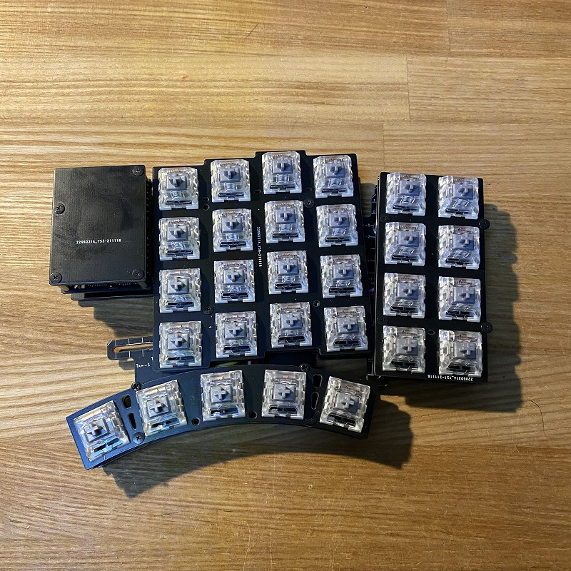  

キーキャップをはめて、左右をTRRSケーブルで接続したら完成です。お疲れ様でした！

DROP の MT3 Black を取り付けたときの様子です。

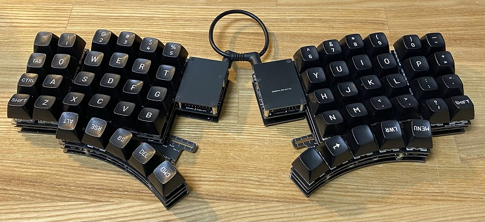  

## 調整編

Pangaea keyboard の価値の一つは位置を調整できることです。好きなように調整してください、なのですが、自由度が高すぎても困ると思いますので私の例で説明します。

まずこれが便利です。

PCB Wrenchです。組み立て後にナットを締めるときに使います。

  

私の調整した結果を例として写真を掲載します。[PHOTO]

### メインプレートの調整

メインプレートはz軸方向の高さ調整が可能です。中心方向の2本のスタンドオフを高くし、中心に向かってチルトさせることができます。

またx軸、y軸方向の調整として左右のメインプレート間の調整用にscaleが用意されています。ある程度固定次第長さに切って使用するとよいでしょう。
[PHOTO]

- 左右の間隔調整
- 左右の角度調整

### 親指プレートの調整

親指プレートはx,y軸方向とz軸方向の調整ができます。
x,y軸方向はTy-=-1〜1 でかつTx =- -1〜3の範囲で調整できます。
また、z軸方向はスタンドオフの長さをメインプレートに比べて少し低くするといった工夫も可能です。親指プレートだけ choc にしてメインプレートに対して高さを抑えることもできます。例です。rev.2[PHOTO ]

### 小指プレートの調整

小指プレートは、左側であれば Pr=0〜12度の回転、Py=-5〜-1 の範囲で調整ができます。

## 拡張編

単純にテキスト入力だけなら標準キットで十分ですが、特定のアプリケーションやWeb会議などやはり専用のキーが欲しくなってりする場面が出てくると思います。
Pangaea は自由に拡張でき、かつ接続の標準インタフェースを定めているためパーツの交換が容易にできます。

ここではキーの追加、Rotary Encoder,OLED, Joy Stick, Dial switch の追加方法について説明します。

Pangaea の設計は e3w2q さんなのです。つまり SU120 の作者さんです。SU120 と組み合わせることで Function key や Rotary Encoder などを追加することができます。

作例はこちらです。Rev.2 での様子です。
[photo]

### キーの追加

キーを追加する方法です。

1. SU120を利用してキーの追加
2. QMK Firmware の対応

### ロータリーエンコーダの追加

ロータリーエンコーダを追加する方法です。

1. SU120を利用してロータリーエンコーダの追加
2. QMK Firmware の対応

### OLEDディスプレイの追加

OLEDディスプレイを追加する方法です。

1. OLEDディスプレイの取り付け
2. QMK Firmware の対応

### マイコンボードの切り離し

メインプレートにある Pro Micro 部分は切り離すことができます。内側にキーを追加したい場合やトラックボールを配置するなどこの部分が邪魔になる場合は切り離して、メインプレートとワイヤで配線することで別の場所に移動することができます。

[Photo]()

1. 切り離し
2. メインプレートとマイコンボードの配線

- 未検証

