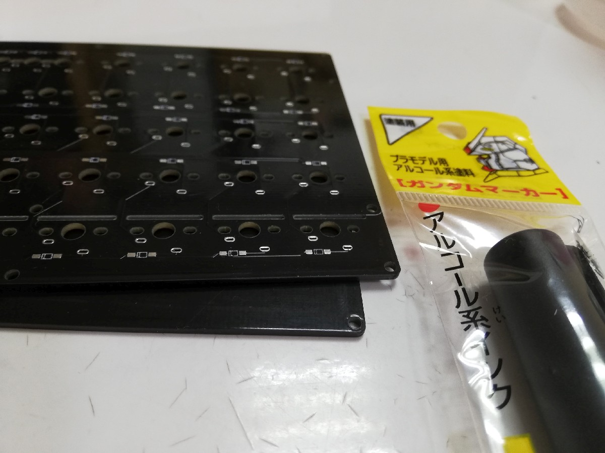
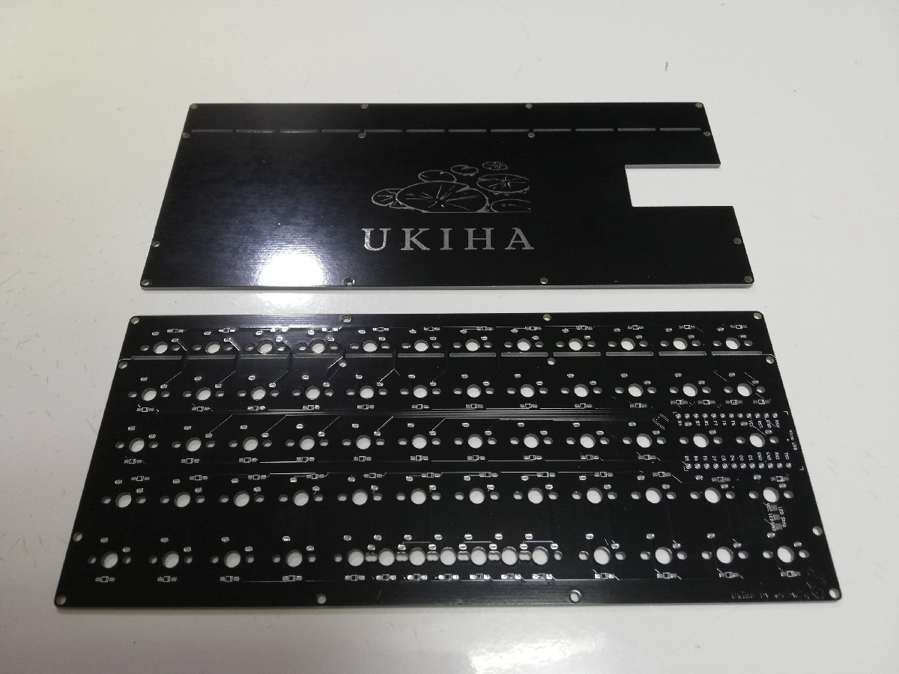
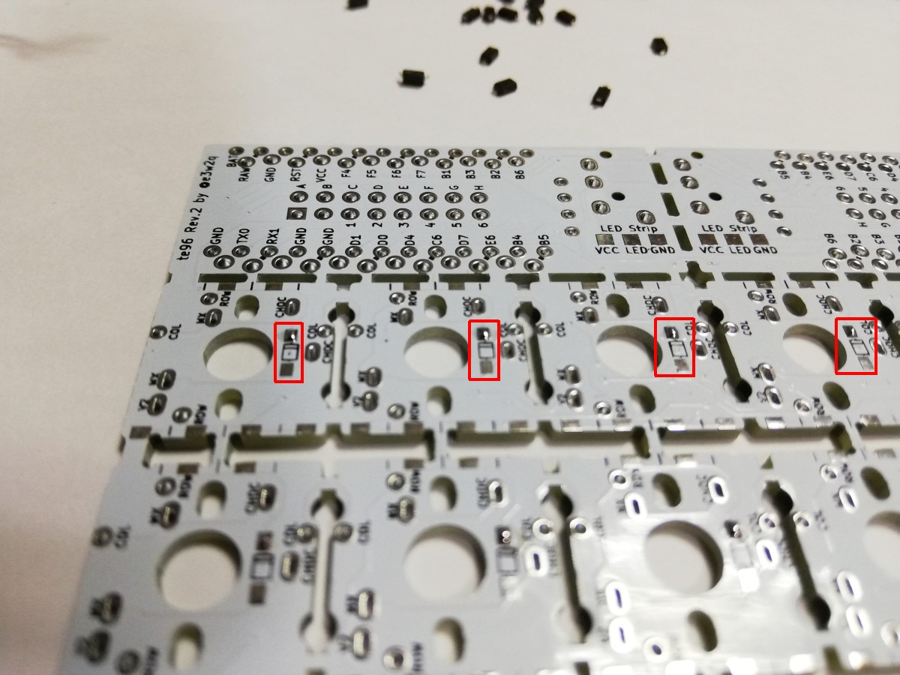
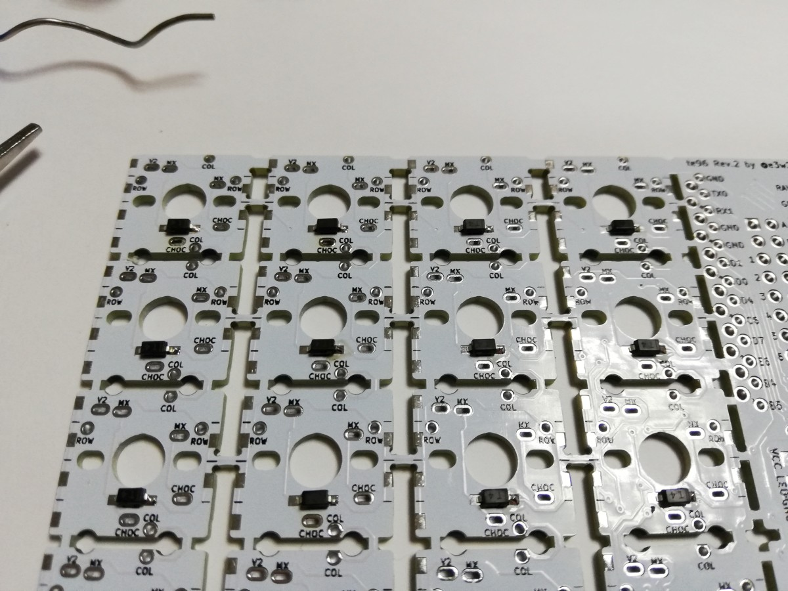
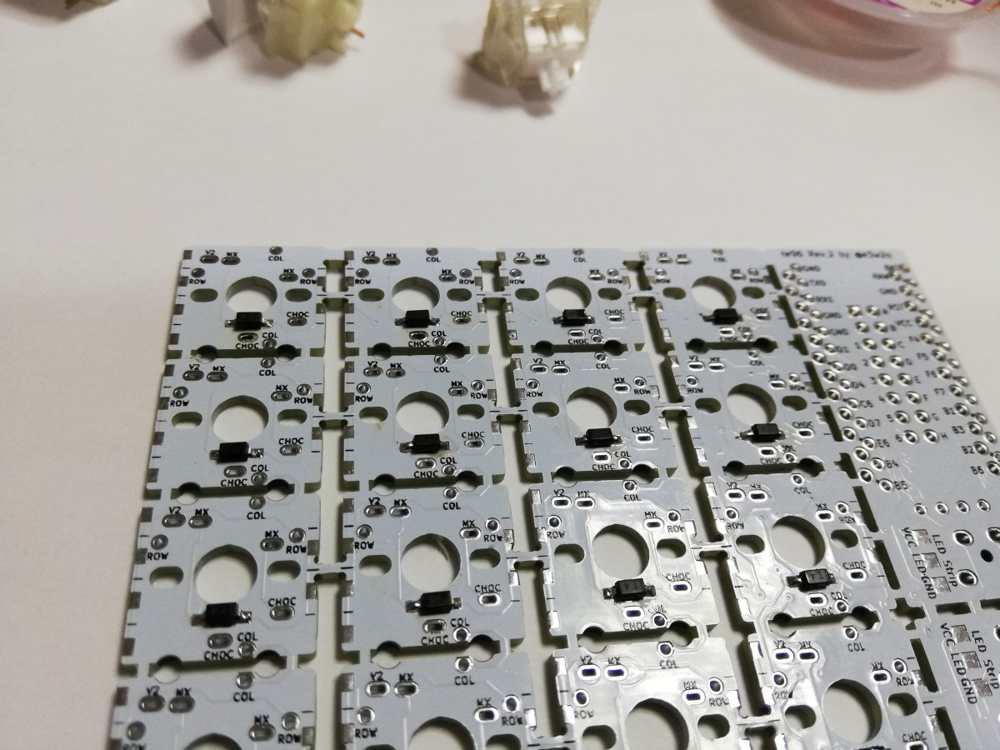
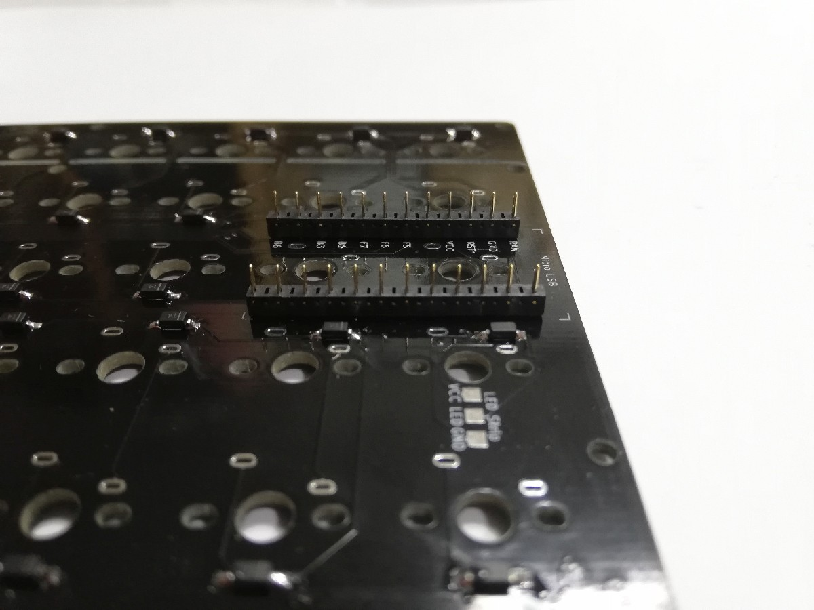
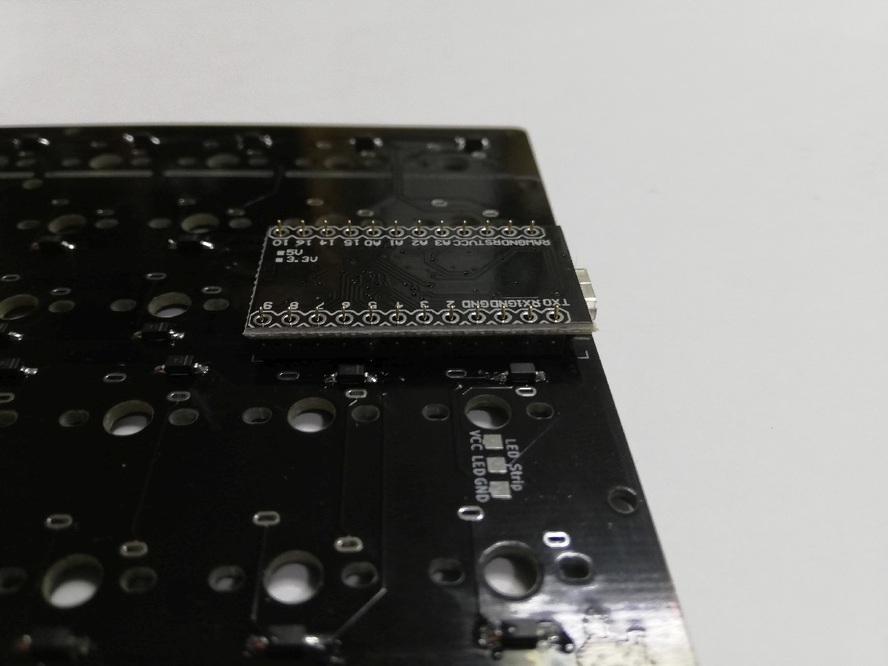
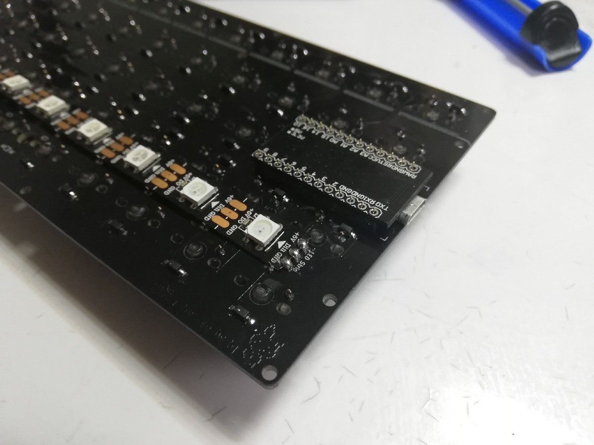
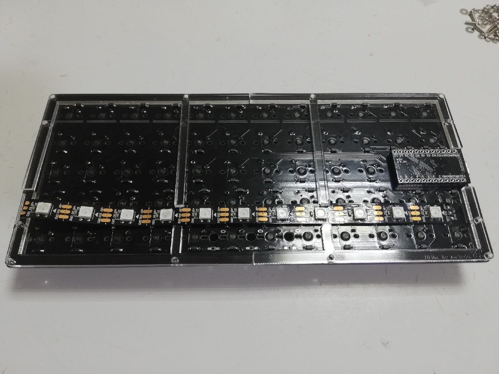
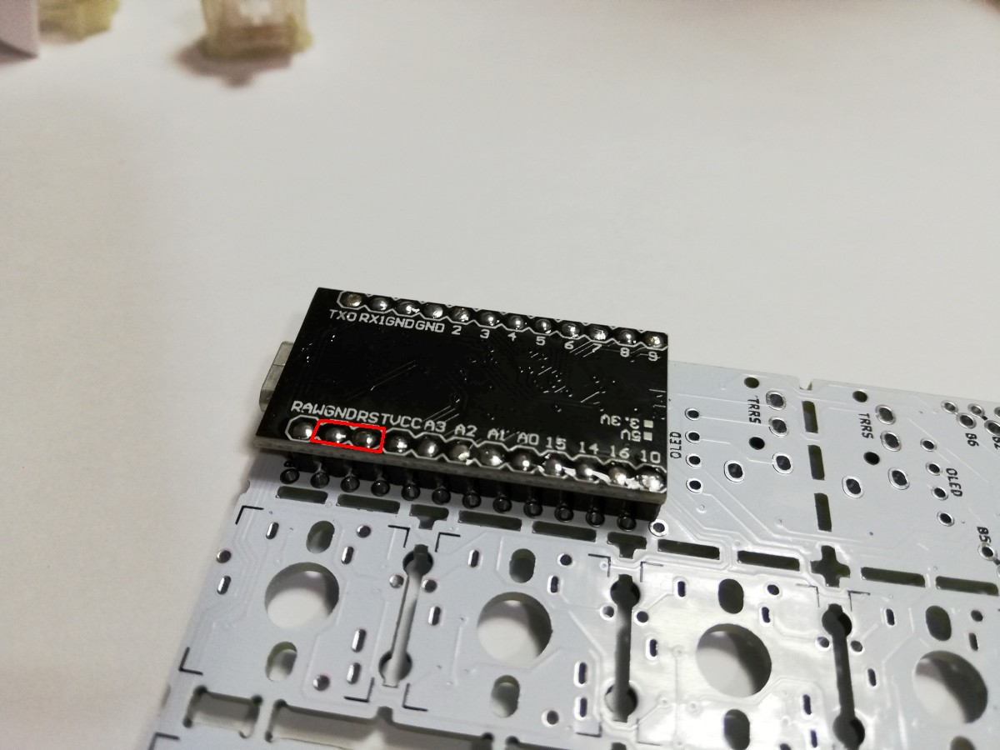

# 浮葉 ビルドガイド

<!-- TOC -->

- [浮葉 ビルドガイド](#浮葉-ビルドガイド)
    - [必要なパーツ](#必要なパーツ)
    - [使用する道具、消耗品](#使用する道具消耗品)
    - [ビルドガイド](#ビルドガイド)
        - [Pro Microのもげ防止加工](#pro-microのもげ防止加工)
        - [基板側面のヤスリがけ（お好みで）](#基板側面のヤスリがけお好みで)
        - [基板側面の塗装（お好みで）](#基板側面の塗装お好みで)
        - [はんだ付けのイメージトレーニング](#はんだ付けのイメージトレーニング)
        - [ダイオードの取り付け](#ダイオードの取り付け)
        - [キースイッチの取り付け](#キースイッチの取り付け)
        - [Pro Microの取り付け](#pro-microの取り付け)
        - [テープLEDの取り付け](#テープledの取り付け)
        - [ミドルプレート、ボトムプレートの取り付け](#ミドルプレートボトムプレートの取り付け)
        - [キーキャップの取り付け](#キーキャップの取り付け)
        - [ゴム足の取り付け](#ゴム足の取り付け)
        - [ファームウェアの書き込み](#ファームウェアの書き込み)
    - [トラブルシューティング](#トラブルシューティング)

<!-- /TOC -->

## 必要なパーツ

[浮葉 パーツリスト](bom_list_jp.md)をご覧ください。

## 使用する道具、消耗品

[使用する道具、消耗品](tool_guide_jp.md)におすすめの道具類、注意事項等をまとめましたのでご覧ください。

## ビルドガイド

### Pro Microのもげ防止加工

Pro Microにエポキシ接着剤を盛って、簡単にはもげないようにします。

参考1:[ProMicroのモゲ防止ついでにQMK_Firmwareを書き込む - Qiita](https://qiita.com/hdbx/items/2f3e4ddfcadda2a5578e)
参考2:[もげ予防 - Self-Made Keyboards in Japan](https://scrapbox.io/self-made-kbds-ja/%E3%82%82%E3%81%92%E4%BA%88%E9%98%B2)

エポキシ接着剤の2液を混ぜます。


接着剤を付け始める前にMicro USBコネクタを横から見てください。側面に穴が開いています。この穴に接着剤が入ると端子が入らなくなったり、入りにくくなったりします。


この穴を避けて、つまようじなどで接着剤を盛っていきます。


乾くまで置いておきます。

### 基板側面のヤスリがけ（お好みで）

基板の側面にザラつきがある場合、机に紙ヤスリを置き、その上で基板のバリがある側面をヤスリがけします。Pro Microの側面もヤスリがけします。

### 基板側面の塗装（お好みで）

基板の側面を太めのマジックで塗ります。細いマジックだとムラが出やすいので太めのマジックで一度に塗るとよいです。Twitterで@swan_matchさんにガンダムマーカーがよいと教えてもらいましたが、確かにきれいに塗れました。塗る場合はPro Microの側面も塗っておくとよいです。



スリット部分はマッキー極細（0.5mm）でギリギリ塗れますが、塗るのがかなり大変ですし、側面のようによく目に付く場所ではないため、塗らなくてもよいと思います。

### はんだ付けのイメージトレーニング

はんだ付けに慣れている方は次の項に進んでください。

全くはんだ付けをしたことがなかったり、数年ぶりにはんだ付けをする場合は、以下の動画が参考になります。

- [はんだ付けの詳細.m2p - YouTube](https://www.youtube.com/watch?v=ZA-ehWjRfYM)

- [チップ抵抗のはんだ付けと、はんだ量の調整（体験用基板を使用） - YouTube](https://www.youtube.com/watch?v=vqKKElJ1vw0)

- [基礎からわかる！自キ入門講座 第8回「自作キーボードのつくりかた #2」 - YouTube](https://www.youtube.com/watch?v=LOC53FeU-QM&t=999)

### ダイオードの取り付け

**基板裏側**にキースイッチの数だけダイオードを取り付けます。

何も書いていない側が基板の表で、ダイオードの印が描いてあるほうが裏です。画像は裏側です。



まず片方のパッド上にはんだを溶かして盛ります。以降の画像は時々別の基板だったりしますが、やることは同じです。



ダイオードをピンセットでつまみ、基板のシルク印刷の二重線と、表面実装ダイオードの二重線の向きを合わせて、パッドに置きます。

先程パッドに盛ったはんだを溶かしてダイオードの片側をはんだ付けします。

うまくいかない場合は以下の動画をご覧ください。

- [チップ抵抗のはんだ付けと、はんだ量の調整（体験用基板を使用） - YouTube](https://www.youtube.com/watch?v=vqKKElJ1vw0)



表面実装ダイオードのはんだ付けをしていない側をはんだ付けします。



### キースイッチの取り付け

表側から差し込みます。トッププレート無しでもキースイッチのガタつきがないよう、穴のサイズを小さめにしてあります。キースイッチの足が曲がっている場合はまっすぐにしてから差し込んでください。


裏返します。

Pro Microが取り付けられる部分のスイッチ2個の足を基板からはみ出さないようにニッパーでカットしておきます。

ハンダ付けします。


### Pro Microの取り付け

**基板裏側**のPro Micro設置部分のスルーホールに、コンスルーピンヘッダを根本まで差し込みます。

その際、

- コンスルーピンヘッダの金色の窓が遠い側を基板側とし、金色の窓が近い側をProMicro側とする
- 金色の窓の向きを揃える

ようにしてください。

参考: [Helixベータ ビルドガイド](https://github.com/MakotoKurauchi/helix/blob/master/Doc/buildguide_jp.md#pro-micro)



ピンヘッダにPro Microを差し込みます。**Pro Microの裏面（平らなほう）が上になるように、またマイクロUSBが基板端になるように**します。

**向きを間違えるとリカバリーが大変です。表裏、左右をよく確認してください。**



Pro Microとコンスルーピンヘッダをハンダ付けします。まず四隅をハンダ付けし、横から見てコンスルーピンヘッダとの間に隙間があれば押さえながらハンダを温めて浮かないようにします。そのあと、順番に全てハンダ付けします。

基板とコンスルーピンヘッダは接触しているため、ハンダ付けしません。

### テープLEDの取り付け

基板裏のPro Microの近くの`LED Stripe`と印字してある場所のパッドにテープLEDをハンダ付けします。

ハンダ付けの前にテープLEDの向き、端子の並びを確認してください。また、スイッチの端子と重ならないようにマスキングテープで仮止めしてください。



### ミドルプレート、ボトムプレートの取り付け

基板の上に、テープLEDとPro Microに干渉しないようにミドルプレートを置きます。



さらにボトムプレートを置きます。基板の表側からネジ穴にM2ネジを差し込み、ナットを締めます。

### キーキャップの取り付け

キースイッチにキーキャップ（16mmキーピッチに適合するもの）をはめます。

### ゴム足の取り付け

ゴム足を裏面の四隅に取り付けます。

### ファームウェアの書き込み

以下のリンク先を参考にして、QMK Firmwareのビルド環境を用意します。

- Windows
  - [QMKビルド環境の構築(Windows Msys2編)](https://gist.github.com/e3w2q/4bc86e531d1c893d3d13af3e9895a94a)
- macOS
  - [セットアップ - QMK Firmware](https://docs.qmk.fm/#/ja/newbs_getting_started?id=macos)
- Linux
  - [セットアップ - QMK Firmware](https://docs.qmk.fm/#/ja/newbs_getting_started?id=linux)

構築中、

```
qmk setup
```

と入力する代わりに

```
qmk setup e3w2q/qmk_firmware --branch e3w2q
```

と入力してください。

または、`qmk setup`した後に、`C:\Users\USER_NAME\qmk_firmware\keyboards`配下に[https://github.com/e3w2q/qmk_firmware/tree/e3w2q/keyboards/e3w2q](https://github.com/e3w2q/qmk_firmware/tree/e3w2q/keyboards/e3w2q)以下をコピーしてもよいです。

用意されたキーマップを書き込むには以下を実行します。

```
qmk flash -kb e3w2q/ukiha -km default
```

`Detecting USB port, reset your controller now...`と表示されたらPro Microの`GND`と`RST`をピンセットやクリップなどで短絡させると書き込みが始まります。



[QMK Configuratorのテストモード](https://config.qmk.fm/#/test)でキー入力が行えるかテストしてください。

## トラブルシューティング

- 特定のキーが反応しない
  - キースイッチのハンダ付けが甘い場合があります。キースイッチを押すかわりに、キースイッチの裏面のハンダ2箇所をピンセットでショートさせてみて、入力されるか確認してください。入力される場合は、ハンダ付けし直してみてください。
- 行、列単位でキーが反応しない
  - Pro Microと基板がうまく導通していない可能性があります。該当する行または列のPro Microの足をハンダ付けし直してみてください。
