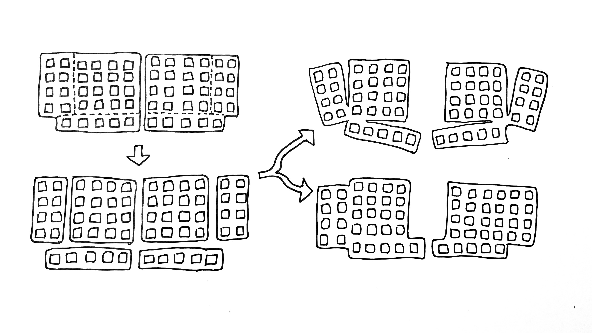
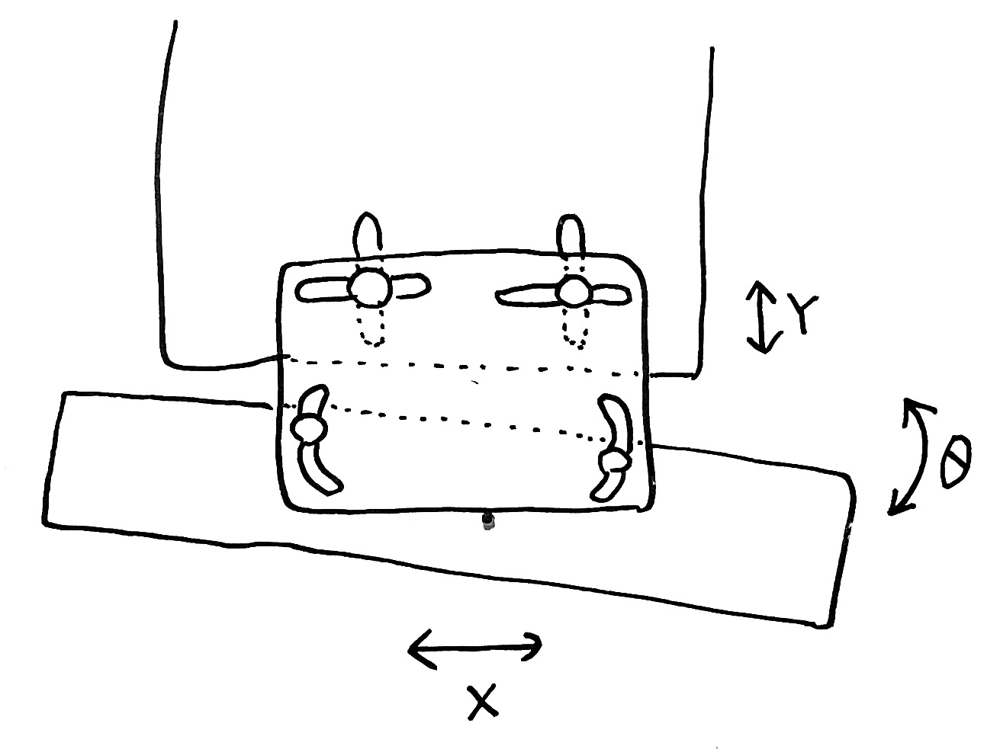

# White Paper on Pangaea keyboard

## What's Pangaea?

### 何なのか

Pangaea (パンゲア) は、キーレイアウトをいくつかの "島" に切り離し、それぞれの島の位置を自由に移動できるようにしたキーボードです。

キー配列のかたまりが移動する様子を大陸移動説になぞらえて、超大陸にちなんでPangaeaと名付けました。

### 何ができるのか

島を動かすことで、個人の好みや手の形（癖、体型）に合わせてキー配置を調整できます。椅子の座り心地を確かめながら座面の高さや背もたれの角度を調整するように、キーボードを使いながら心地よく使える形に調整していくことができます。

## Why Pangaea?

何のために作られたのか

### 原体験 (by otahinosame)

カラムスタッガード配列のキーボードはいろいろあるが、気になる違いは小指の高さと親指のキーの位置。しかし、どれが自分に合うかは試してみないとわからない。数万円かけて作らないと実使用上のテストはできない。せめてどれくらいの高さが合うか確かめてからKitを買いたい。（局所解を避けたい、せっかく買ったのだからバイアスを避けたい、実際に比較して決めたい）

 ### 欲求

使用しながら気軽に調整できるキーボードが欲しい。キー配置を調整できるキーボードを簡単に作れるKitが欲しい。
みんなも欲しいはず！
…という経緯で開発に至りました。

## How Pangaea works?

どうなっているのか

- 島と島の相対位置は、接続パーツで連結。自由に可動・固定ができます。
    - 例えば、レール上にスリットを開けたプレートを組み合わせることで、連続的に位置と角度が調整できます。
    
        

- 島同士の電気的な接続は、ワイヤーなどフレキシブルな配線を使うことで結線したまま島を動かせます。
- 島は規格にしたがって自由に置き換え・拡張ができます。
- 追加の要素も自由に接続可能です。
    - 追加のキー、ロータリーエンコーダー
    - トラックボール（今後検証予定）

    

## Where Pangaea going?

今後の展望

### ハードウェアの展望

- レイアウトの異なるパーツのバリエーション
- ロウ・スタッガード配列
- オーソリニア

### 使いこなしサポート

- 調整手順ガイドを拡充
- カスタム作例の紹介